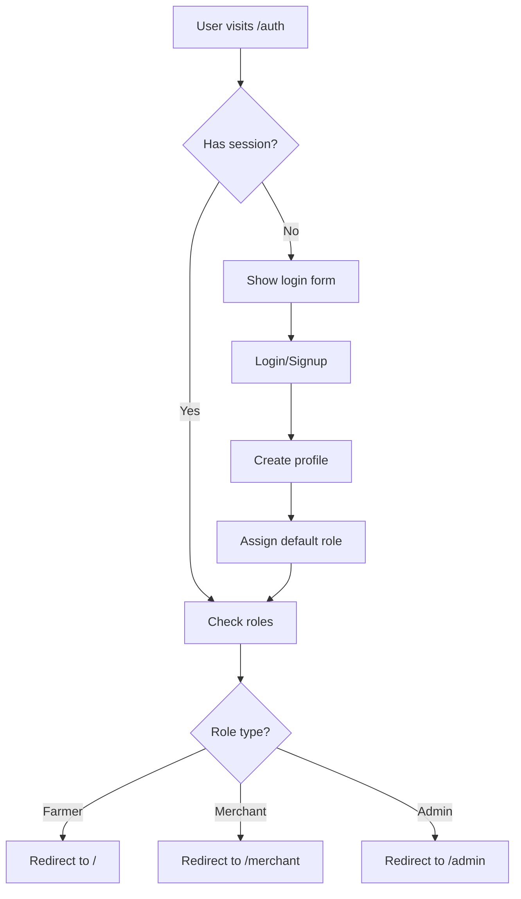
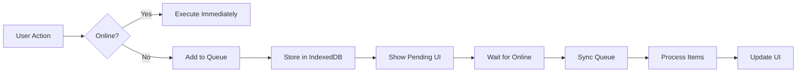

# Architecture Documentation

## Table of Contents
1. [Project Overview](#1-project-overview)
2. [Architecture Patterns](#2-architecture-patterns)
3. [Database Schema](#3-database-schema)
4. [Authentication & Authorization](#4-authentication--authorization)
5. [State Management](#5-state-management)
6. [Offline-First Architecture](#6-offline-first-architecture)
7. [Edge Functions](#7-edge-functions-backend-logic)
8. [Testing Strategy](#8-testing-strategy)
9. [Routing](#9-routing)
10. [File Organization](#10-file-organization-best-practices)
11. [Known Technical Debt](#11-known-technical-debt)
12. [Performance Optimizations](#12-performance-optimizations)
13. [Mobile Support](#13-mobile-capacitor)

---

## 1. Project Overview

### Purpose
**Doc Aga** is a comprehensive farm management system designed for livestock operations (cattle, goats, sheep, carabao, swine, poultry). It provides multi-role support for:
- **Farmers/Farm Owners**: Manage livestock, track health records, monitor production
- **Farmhands**: Quick activity logging via voice commands
- **Merchants**: Sell farm supplies through integrated marketplace
- **Admins**: System oversight and user management

### Technology Stack

**Frontend:**
- React 18 + TypeScript
- Vite (build tool)
- Shadcn/ui + Tailwind CSS + Radix UI
- TanStack Query (React Query) for state management
- React Hook Form + Zod for form validation
- React Router v6 for routing

**Backend:**
- Lovable Cloud (powered by Supabase)
- PostgreSQL database with Row-Level Security
- Edge Functions (Deno runtime)
- Storage buckets for files

**Mobile:**
- Capacitor for Android native app
- Local notifications support

**Testing:**
- Vitest + React Testing Library
- Current coverage: ~15-20%

### Key Features
- 🐄 **Animal Management**: Complete livestock registry with unique codes
- 📊 **Health Tracking**: Milking, feeding, health events, weight records
- 🎙️ **Voice AI (Doc Aga)**: AI veterinary assistant with voice commands
- 📴 **Offline-First**: IndexedDB caching with automatic sync
- 🏪 **Marketplace**: B2B platform for farm supplies
- 📦 **Feed Inventory**: Stock management and forecasting
- 👥 **Team Management**: Multi-user farms with role-based permissions

---

## 2. Architecture Patterns

### Frontend Architecture

```
src/
├── pages/              # Route-level components
│   ├── Dashboard.tsx   # Farmer main dashboard
│   ├── Auth.tsx        # Farmer authentication
│   ├── MerchantAuth.tsx # Merchant portal
│   ├── AdminAuth.tsx   # Admin portal
│   └── ...
├── components/         # Reusable UI components
│   ├── ui/            # Base Shadcn components (Button, Card, etc.)
│   ├── admin/         # Admin-specific features
│   ├── merchant/      # Merchant-specific features
│   ├── farmhand/      # Farmhand activity logging
│   └── ...            # Feature-specific components
├── hooks/             # Custom React hooks
│   ├── useRole.ts     # User role detection
│   ├── usePermissions.ts # Farm-level permissions
│   └── ...
├── lib/               # Utility functions & business logic
│   ├── offlineQueue.ts  # Offline activity queue
│   ├── syncService.ts   # Sync orchestration
│   ├── dataCache.ts     # IndexedDB caching
│   └── ...
├── integrations/      # External service integrations
│   └── supabase/      # Supabase client & types
└── test-utils/        # Testing utilities
```

### Key Design Patterns

**Component Composition**
- Built on Radix UI primitives with custom Tailwind styling
- Variant-based component design (Button, Badge, Card variants)
- Compound components for complex UI (Form, Dialog, Dropdown)

**Data Fetching**
- TanStack Query for all server state
- Aggressive caching with smart invalidation
- Background refetching for stale data
- Optimistic updates for better UX

**Form Management**
- React Hook Form for form state
- Zod for runtime validation
- Controlled components for consistency

**Offline Support**
- IndexedDB for persistent storage
- Queue-based sync mechanism
- Automatic conflict resolution

**Authentication**
- Multi-portal design (separate login flows)
- JWT-based authentication
- Role-based access control (RBAC)

---

## 3. Database Schema

### Core Tables

**User Management:**
```sql
profiles              # User profile information
├── id (uuid)         # References auth.users
├── full_name         # Display name
├── email             # Contact email
├── phone             # Phone number
└── avatar_url        # Profile picture

user_roles           # Multi-role support
├── user_id (uuid)    # References auth.users
├── role (enum)       # admin, farmer_owner, farmhand, merchant, etc.
└── is_super_admin    # Super admin flag
```

**Farm Management:**
```sql
farms                # Farm registry
├── id (uuid)
├── owner_id         # References auth.users
├── name
├── region
├── livestock_type   # cattle, goat, sheep, etc.
└── is_deleted       # Soft delete flag

farm_memberships     # Team members
├── farm_id
├── user_id
├── role_in_farm     # farmer_owner or farmhand
└── invitation_status # pending, accepted, rejected
```

**Livestock:**
```sql
animals              # Livestock registry
├── id (uuid)
├── farm_id
├── unique_code      # Auto-generated: RUM-YYMM-NNNNNNNN
├── name
├── ear_tag
├── livestock_type
├── breed
├── gender
├── birth_date
├── life_stage       # calf, heifer, bull, cow
└── current_weight_kg

ai_records           # Artificial insemination
milking_records      # Milk production
health_records       # Health events
feeding_records      # Feed consumption
weight_records       # Weight tracking
```

**Marketplace:**
```sql
merchants            # Merchant profiles
├── id (uuid)
├── user_id
├── business_name
├── business_description
└── contact_info

products             # Product catalog
├── id (uuid)
├── merchant_id
├── name
├── description
├── price
├── stock_quantity
└── category

orders               # Customer orders
├── id (uuid)
├── farmer_id
├── merchant_id
├── order_number     # Auto-generated
├── status           # pending, in_process, in_transit, delivered
└── total_amount
```

**AI Assistant:**
```sql
doc_aga_faqs         # Veterinary knowledge base
doc_aga_queries      # User query history
voice_training_samples # Voice training data
```

### Security Model

**Row-Level Security (RLS):**
All tables have RLS enabled with policies based on:

1. **Role-Based Policies**: Using `has_role(_user_id, _role)` function
2. **Farm-Level Access**: Using `can_access_farm(farm_id)` function
3. **Ownership Checks**: Direct `owner_id = auth.uid()` comparisons

**Security Helper Functions:**
```sql
has_role(user_id, role)              # Check if user has role
is_farm_owner(user_id, farm_id)      # Check farm ownership
is_farm_manager(user_id, farm_id)    # Check manager status
is_farmhand(user_id, farm_id)        # Check farmhand access
can_access_farm(farm_id)             # Unified farm access check
```

---

## 4. Authentication & Authorization

### Multi-Portal Architecture

The app uses **three separate authentication portals**:

```
/auth          → Farmer Portal (default)
/auth/merchant → Merchant Portal
/auth/admin    → Admin Portal
```

Each portal has its own login/signup flow with role-specific post-auth routing.

### Role Hierarchy

```
admin (Super Admin)
  ├── farmer_owner (Farm Owner)
  │   ├── farmhand (Farm Worker)
  │   └── [can manage farm]
  └── merchant (Business User)
      └── [can sell products]
```

### Permission System

**`useRole()` Hook:**
```typescript
const { roles, isLoading, isMerchant, isFarmer, isAdmin, hasRole } = useRole();

// Usage:
if (isAdmin) {
  // Show admin features
}

if (hasRole('merchant')) {
  // Show merchant dashboard
}
```

**`usePermissions(farmId)` Hook:**
```typescript
const {
  isOwner,         // Farm owner
  isManager,       // Has farmer_owner role (not owner)
  canManageFarm,   // Owner, manager, or admin
  canEditAnimals,  // Can modify livestock records
  canDeleteAnimals, // Can remove animals
  canManageTeam,   // Can invite/remove members
  canViewReports,  // Can access analytics
  isLoading
} = usePermissions(farmId);
```

**`useAdminAccess()` Hook:**
```typescript
// For admin-only pages
const { isAdmin, isLoading } = useAdminAccess();
// Automatically redirects non-admins
```

### Authentication Flow



---

## 5. State Management

### Server State (TanStack Query)

Used for **all data from the backend**. Provides:
- Automatic caching
- Background refetching
- Loading/error states
- Optimistic updates

**Example Custom Hooks:**
```typescript
// src/hooks/useProfile.ts
export const useProfile = () => {
  return useQuery({
    queryKey: ['profile'],
    queryFn: async () => {
      const { data: { user } } = await supabase.auth.getUser();
      if (!user) throw new Error('Not authenticated');
      
      const { data, error } = await supabase
        .from('profiles')
        .select('*')
        .eq('id', user.id)
        .single();
      
      if (error) throw error;
      return data;
    }
  });
};

// src/hooks/useMerchantProducts.ts
export const useMerchantProducts = (merchantId: string) => {
  return useQuery({
    queryKey: ['merchant-products', merchantId],
    queryFn: async () => {
      const { data, error } = await supabase
        .from('products')
        .select('*')
        .eq('merchant_id', merchantId)
        .order('created_at', { ascending: false });
      
      if (error) throw error;
      return data;
    },
    enabled: !!merchantId
  });
};
```

### Client State

**React Context:**
- `CartProvider` in `useCart.tsx` - Shopping cart state
- Persisted to localStorage

**Local Component State:**
- `useState` for UI-only state (modals, dropdowns, tabs)
- `useReducer` for complex local state machines

### Offline State (IndexedDB)

**`offlineQueue.ts`** - Activity queue for offline operations:
```typescript
interface QueueItem {
  id: string;
  type: 'voice_activity' | 'animal_form';
  payload: {
    audioBlob?: Blob;
    farmId?: string;
    formData?: any;
    transcription?: string;
  };
  status: 'pending' | 'processing' | 'awaiting_confirmation' | 'completed' | 'failed';
  retries: number;
  createdAt: number;
}
```

**`dataCache.ts`** - Aggressive caching for reads:
```typescript
// Animals cached for 1 hour
await cacheAnimals(farmId, animals);
const cached = await getCachedAnimals(farmId);

// Feed inventory cached for 2 hours
await cacheFeedInventory(farmId, inventory);
```

---

## 6. Offline-First Architecture

### Caching Strategy



### Cache Layers

**Level 1: TanStack Query (Memory)**
- 5-minute default stale time
- In-memory cache for speed
- Automatic garbage collection

**Level 2: IndexedDB (Persistent)**
```typescript
dataCache.ts:
├── Animals Cache      (TTL: 1 hour)
├── Records Cache      (TTL: 30 minutes)
├── Feed Inventory     (TTL: 2 hours)
├── Farm Data          (TTL: 24 hours)
└── User Preferences   (TTL: 7 days)

offlineQueue.ts:
├── Voice Activities   (until synced)
└── Form Submissions   (until synced)
```

### Sync Flow

**Voice Activity Sync:**
1. User records voice command → Stored in queue
2. App goes online → `syncService.ts` triggered
3. Audio uploaded to `voice-to-text` edge function
4. Transcription returned → Status: `awaiting_confirmation`
5. User confirms transcription → Status: `pending`
6. Activity processed via `process-farmhand-activity` function
7. Success → Status: `completed`, Notification sent
8. Failure → Status: `failed`, Retry logic applied

**Form Submission Sync:**
1. Form submitted offline → Queued with `status: 'pending'`
2. Online detected → Direct submission to Supabase
3. Success → Remove from queue
4. Failure → Increment retry counter, exponential backoff

### Retry Strategy

```typescript
const MAX_RETRIES = 3;
const RETRY_DELAYS = [5000, 15000, 60000]; // 5s, 15s, 1m

if (retries < MAX_RETRIES) {
  setTimeout(() => retrySync(item), RETRY_DELAYS[retries]);
} else {
  updateStatus(item.id, 'failed', 'Max retries exceeded');
  showNotification('Sync failed. Please try again manually.');
}
```

---

## 7. Edge Functions (Backend Logic)

### Function Overview

**AI-Powered Functions:**
```typescript
doc-aga/                    # AI veterinary assistant
├── index.ts               # Main Lovable AI chat
└── tools.ts               # Function calling tools

voice-to-text/             # Speech recognition (Lovable AI)
text-to-speech/            # Voice synthesis (Lovable AI)
process-voice-training/    # Voice model training
```

**Business Logic Functions:**
```typescript
process-farmhand-activity/ # Parse & log voice activities
calculate-daily-stats/     # Aggregate farm statistics (cron)
backfill-stats/           # Historical stats calculation
populate-weights/         # Auto-populate weight estimates
```

**User Management:**
```typescript
send-team-invitation/     # Email invites via Resend
admin-create-user/        # Admin user creation
merchant-signup/          # Merchant onboarding
```

**Webhooks:**
```typescript
report-test-results/      # CI/CD test reporting
admin-permanent-delete-farm/ # Hard delete farms (admin only)
```

### Security Features

**JWT Authentication:**
```typescript
const authHeader = req.headers.get('Authorization');
if (!authHeader) throw new Error('Missing authorization header');

const token = authHeader.replace('Bearer ', '');
const { data: { user }, error } = await supabaseClient.auth.getUser(token);

if (error || !user) throw new Error('Invalid token');
```

**Rate Limiting:**
```typescript
const RATE_LIMIT = 15; // requests per minute
const userKey = `rate:${user.id}`;

const count = await redis.incr(userKey);
if (count === 1) await redis.expire(userKey, 60);
if (count > RATE_LIMIT) {
  throw new Error('Rate limit exceeded');
}
```

**Input Validation:**
```typescript
import { z } from 'zod';

const requestSchema = z.object({
  message: z.string().min(1).max(1000),
  farmId: z.string().uuid(),
  animalId: z.string().uuid().optional()
});

const body = requestSchema.parse(await req.json());
```

**Sanitized Error Messages:**
```typescript
try {
  // ... operation
} catch (error) {
  console.error('Detailed error:', error); // Log for debugging
  
  return new Response(
    JSON.stringify({ error: 'Failed to process request' }), // Generic message
    { status: 500 }
  );
}
```

### Deployment

Edge functions are **automatically deployed** on code push. No manual deployment needed.

---

## 8. Testing Strategy

### Current Coverage: ~15-20%

### Test Types

**Unit Tests (*.test.ts):**
- Utility functions
- Business logic calculations
- Data transformations

**Examples:**
- `animalStages.test.ts` - Life stage calculations
- `feedInventory.test.ts` - Feed forecast algorithms
- `weightEstimates.test.ts` - Weight estimation logic
- `utils.test.ts` - Helper functions

**Integration Tests (*.test.tsx):**
- Component behavior
- User interactions
- Data flow

**Examples:**
- `AnimalForm.test.tsx` - Form submission flow
- `useCart.test.tsx` - Shopping cart logic
- `ActivityConfirmation.integration.test.tsx` - Farmhand workflow

**Hook Tests:**
- Custom hooks with `renderHook`
- State management logic
- Side effect handling

**Examples:**
- `usePermissions.test.ts` - Permission calculations
- `useRole.test.ts` - Role detection
- `useProfile.test.ts` - Profile data fetching

### Testing Utilities

**`src/test-setup.ts`** - Global configuration:
```typescript
import '@testing-library/jest-dom';
import { cleanup } from '@testing-library/react';
import { afterEach, vi } from 'vitest';

afterEach(() => {
  cleanup();
  vi.clearAllMocks();
});
```

**`src/test-utils.tsx`** - Custom render functions:
```typescript
import { QueryClient, QueryClientProvider } from '@tanstack/react-query';
import { render } from '@testing-library/react';

export const renderWithProviders = (ui: React.ReactElement) => {
  const queryClient = new QueryClient({
    defaultOptions: { queries: { retry: false } }
  });
  
  return render(
    <QueryClientProvider client={queryClient}>
      {ui}
    </QueryClientProvider>
  );
};
```

**`src/test-utils/supabase-mocks.ts`** - Supabase mocking:
```typescript
import { vi } from 'vitest';

export const mockSupabaseAuth = (user = null) => {
  vi.mocked(supabase.auth.getUser).mockResolvedValue({
    data: { user },
    error: null
  });
};

export const mockSupabaseQuery = (data: any, error = null) => {
  vi.mocked(supabase.from).mockReturnValue({
    select: vi.fn().mockReturnThis(),
    eq: vi.fn().mockResolvedValue({ data, error })
  } as any);
};
```

### Running Tests

```bash
npm test                # Run all tests
npm run test:watch      # Watch mode
npm run test:coverage   # Generate coverage report
npm run test:ui         # Interactive Vitest UI
```

### Test Coverage Goals

**Short-term (3 months):**
- [ ] 60% overall coverage
- [ ] 100% coverage for `src/lib/` utilities
- [ ] 80% coverage for custom hooks

**Long-term (6 months):**
- [ ] 80% overall coverage
- [ ] E2E tests with Playwright
- [ ] Visual regression testing

---

## 9. Routing

### Route Structure

```typescript
/                        # Dashboard (Farmer main page)
/auth                    # Farmer authentication
/auth/merchant           # Merchant authentication
/auth/admin              # Admin authentication
/profile                 # User profile & settings
/admin                   # Admin dashboard (super admin only)
/admin/create-user       # Create new users
/merchant                # Merchant dashboard
/farmhand                # Farmhand activity logging
/marketplace             # Product browsing
/checkout                # Order checkout
/orders                  # Order history
/voice-training          # Voice training for farmhands
/invite/accept/:token    # Accept team invitation
/messaging               # Future: Messaging system
/distributor-finder      # Future: Find distributors
```

### Route Guards

**Admin Routes:**
```typescript
// src/hooks/useAdminAccess.ts
export const useAdminAccess = () => {
  const navigate = useNavigate();
  
  useEffect(() => {
    const checkAccess = async () => {
      const { data } = await supabase.rpc('is_super_admin', {
        _user_id: user.id
      });
      
      if (!data) {
        toast({ title: 'Access Denied', variant: 'destructive' });
        navigate('/');
      }
    };
    
    checkAccess();
  }, []);
};
```

**Authentication Checks:**
```typescript
// In page components
useEffect(() => {
  const { data: { subscription } } = supabase.auth.onAuthStateChange(
    (event, session) => {
      if (!session) navigate('/auth');
    }
  );
  
  return () => subscription.unsubscribe();
}, []);
```

**Role-Based Rendering:**
```typescript
const { isMerchant, isFarmer, isAdmin } = useRole();

if (isAdmin) return <AdminDashboard />;
if (isMerchant) return <MerchantDashboard />;
if (isFarmer) return <FarmerDashboard />;
```

---

## 10. File Organization Best Practices

### Component Classification

**Page Components (`src/pages/*`):**
- Route-level components
- Handle authentication checks
- Coordinate data loading
- Minimal business logic
- Should be < 400 lines (refactor if larger)

**Feature Components (`src/components/*`):**
- Business logic components
- Domain-specific functionality
- Reusable across pages
- Should be < 300 lines

**UI Components (`src/components/ui/*`):**
- Pure presentational components
- Based on Shadcn/ui
- No business logic
- Highly reusable
- Should be < 150 lines

### Naming Conventions

```typescript
// Components - PascalCase
AnimalForm.tsx
FarmDashboard.tsx
ProductCard.tsx

// Utilities - camelCase
animalStages.ts
feedInventory.ts
syncService.ts

// Hooks - camelCase with 'use' prefix
useRole.ts
usePermissions.ts
useAdminAccess.ts

// Tests - same name + .test
AnimalForm.test.tsx
animalStages.test.ts
useRole.test.ts

// Types - PascalCase + .types
animal.types.ts
order.types.ts
```

### Import Order

```typescript
// 1. React imports
import { useState, useEffect } from 'react';

// 2. Third-party libraries
import { useQuery } from '@tanstack/react-query';
import { useForm } from 'react-hook-form';
import { zodResolver } from '@hookform/resolvers/zod';

// 3. Internal components
import { Button } from '@/components/ui/button';
import { AnimalForm } from '@/components/AnimalForm';

// 4. Internal utilities
import { supabase } from '@/integrations/supabase/client';
import { calculateLifeStage } from '@/lib/animalStages';

// 5. Types
import type { Animal } from '@/integrations/supabase/types';

// 6. Styles (if any)
import './styles.css';
```

### File Size Guidelines

```
< 150 lines  ✅ Excellent
150-300 lines  ⚠️ Monitor
300-500 lines  🚨 Consider refactoring
> 500 lines  ❌ Must refactor
```

---

## 11. Known Technical Debt

### 🔴 High Priority

**Component Size Issues:**
```
FarmDashboard.tsx        1026 lines  ❌ Critical
Dashboard.tsx             390 lines  🚨 High
MerchantAuth.tsx          382 lines  🚨 High
Auth.tsx                  380 lines  🚨 High
OrderManagement.tsx       350+ lines 🚨 High
```

**Recommended Refactoring:**
```typescript
// Before: FarmDashboard.tsx (1026 lines)
export const FarmDashboard = () => {
  // Mixing: stats, animals list, charts, team management, etc.
};

// After: Split into focused components
FarmDashboard.tsx (200 lines)      # Layout & coordination
├── FarmStatsOverview.tsx          # Statistics cards
├── AnimalListSection.tsx          # Animal table
├── FarmChartsSection.tsx          # Analytics charts
├── FeedInventorySection.tsx       # Feed management
└── TeamManagementSection.tsx      # Team members
```

### 🟡 Medium Priority

**TypeScript Configuration:**
```json
// tsconfig.json - Should enable strict mode gradually
{
  "compilerOptions": {
    "noImplicitAny": false,          // ❌ Should be true
    "strictNullChecks": false,       // ❌ Should be true
    "noUnusedLocals": false,         // ❌ Should be true
    "noUnusedParameters": false      // ❌ Should be true
  }
}
```

**Strategy:**
1. Enable one flag at a time
2. Fix errors in small batches
3. Start with utility files, then hooks, then components

### 🟢 Low Priority

**Missing Documentation:**
- [ ] JSDoc comments for complex functions
- [ ] Component prop documentation
- [ ] API endpoint documentation in edge functions
- [ ] Database schema diagrams

**Code Duplication:**
- Auth checking logic repeated across pages
- Data fetching patterns similar in multiple hooks
- Form validation schemas duplicated

**Magic Numbers:**
```typescript
// Instead of:
if (weight > 200) { ... }

// Use:
const MIN_COW_WEIGHT_KG = 200;
if (weight > MIN_COW_WEIGHT_KG) { ... }
```

### Testing Coverage Gaps

**Untested Areas:**
- ❌ Admin pages (0% coverage)
- ❌ Merchant pages (0% coverage)
- ❌ Most page components (5% coverage)
- ⚠️ Integration tests (limited)
- ❌ E2E tests (none)

**Current Coverage:**
```
src/lib/          ~80%  ✅
src/hooks/        ~40%  ⚠️
src/components/   ~10%  ❌
src/pages/        ~5%   ❌
```

---

## 12. Performance Optimizations

### Caching Strategy

**IndexedDB (Persistent):**
```typescript
Animals:          1 hour TTL      # Rarely change
Health Records:   30 min TTL      # Moderate updates
Feed Inventory:   2 hours TTL     # Daily updates
Farm Data:        24 hours TTL    # Rarely change
User Preferences: 7 days TTL      # Very stable
```

**TanStack Query (Memory):**
```typescript
const queryClient = new QueryClient({
  defaultOptions: {
    queries: {
      staleTime: 5 * 60 * 1000,      // 5 minutes
      gcTime: 10 * 60 * 1000,        // 10 minutes
      refetchOnWindowFocus: true,
      refetchOnReconnect: true
    }
  }
});
```

### Database Optimizations

**Pre-calculated Statistics:**
```sql
daily_farm_stats         # Aggregated daily metrics
monthly_farm_stats       # Aggregated monthly metrics
```

**Indexed Columns:**
```sql
CREATE INDEX idx_animals_farm_id ON animals(farm_id);
CREATE INDEX idx_animals_ear_tag ON animals(ear_tag);
CREATE INDEX idx_health_records_animal_id ON health_records(animal_id);
CREATE INDEX idx_orders_farmer_id ON orders(farmer_id);
CREATE INDEX idx_orders_merchant_id ON orders(merchant_id);
```

**Optimized Queries:**
```typescript
// Good: Select only needed columns
const { data } = await supabase
  .from('animals')
  .select('id, name, ear_tag, life_stage')
  .eq('farm_id', farmId);

// Bad: Select all columns
const { data } = await supabase
  .from('animals')
  .select('*')
  .eq('farm_id', farmId);
```

### React Optimizations

**Memoization:**
```typescript
// Expensive calculations
const calculatedStage = useMemo(
  () => calculateLifeStage(animal.birth_date, animal.gender),
  [animal.birth_date, animal.gender]
);

// Callback functions passed as props
const handleDelete = useCallback(
  (id: string) => deleteAnimal(id),
  [deleteAnimal]
);
```

**Code Splitting:**
- Vite automatically splits by route
- Future: Lazy load heavy components with `React.lazy()`

### Network Optimizations

**Request Batching:**
```typescript
// Instead of 3 separate requests
const animals = await fetchAnimals(farmId);
const records = await fetchRecords(farmId);
const stats = await fetchStats(farmId);

// Batch in single query with joins
const { data } = await supabase
  .from('farms')
  .select(`
    *,
    animals(*),
    health_records(*),
    daily_farm_stats(*)
  `)
  .eq('id', farmId)
  .single();
```

**Debouncing:**
```typescript
import { useDebouncedValue } from '@/hooks/useDebounce';

const [search, setSearch] = useState('');
const debouncedSearch = useDebouncedValue(search, 300);

// Only triggers API call after 300ms of no typing
useQuery({
  queryKey: ['animals', debouncedSearch],
  queryFn: () => searchAnimals(debouncedSearch)
});
```

---

## 13. Mobile (Capacitor)

### Android Support

**Features:**
- Native Android app (APK/AAB)
- Offline-first design
- Local notifications for sync status
- Deep linking for team invitations
- Native splash screen & icons

### Configuration

**`capacitor.config.ts`:**
```typescript
import type { CapacitorConfig } from '@capacitor/core';

const config: CapacitorConfig = {
  appId: 'app.lovable.fa0cc69c441c4305b8c2e99c9ca1b5ea',
  appName: 'doc-aga',
  webDir: 'dist',
  server: {
    url: 'https://fa0cc69c-441c-4305-b8c2-e99c9ca1b5ea.lovableproject.com',
    cleartext: true // For dev hot-reload
  }
};

export default config;
```

**Android Project:**
- Native code in `android/` (not in Git)
- Generated via `npx cap add android`
- Configure in Android Studio

### Building for Production

**1. Update Version:**
```json
// package.json
{
  "version": "1.0.2"
}
```

```gradle
// android/app/build.gradle
android {
  defaultConfig {
    versionCode 3        // Increment for each release
    versionName "1.0.2"  // Match package.json
  }
}
```

**2. Build & Sync:**
```bash
npm run build              # Build web app
npx cap sync android       # Copy to Android project
npx cap open android       # Open Android Studio
```

**3. Generate Signed Bundle:**
- Android Studio → Build → Generate Signed Bundle/APK
- Select AAB (App Bundle) format
- Upload to Google Play Console

### Deep Linking

**Configuration:**
```json
// capacitor.config.json (plugins section)
{
  "plugins": {
    "App": {
      "deepLinkingEnabled": true,
      "appUrlSchemes": ["docaga"]
    }
  }
}
```

**Usage:**
```typescript
// Handle invite links: docaga://invite/accept/:token
import { App } from '@capacitor/app';

App.addListener('appUrlOpen', (event) => {
  const url = event.url;
  if (url.includes('invite/accept')) {
    const token = url.split('/').pop();
    navigate(`/invite/accept/${token}`);
  }
});
```

### Local Notifications

**Setup:**
```typescript
import { LocalNotifications } from '@capacitor/local-notifications';

// Request permissions
await LocalNotifications.requestPermissions();

// Schedule notification
await LocalNotifications.schedule({
  notifications: [{
    id: 1,
    title: 'Sync Complete',
    body: '3 activities synced successfully',
    schedule: { at: new Date(Date.now() + 1000) }
  }]
});
```

### Testing on Device

**Development:**
1. Ensure phone and computer on same network
2. Update `server.url` in `capacitor.config.ts` to your local IP
3. Run `npx cap run android` to deploy to connected device

**Production Testing:**
1. Build release APK in Android Studio
2. Transfer APK to phone
3. Enable "Install from Unknown Sources"
4. Install and test

---

## Conclusion

This architecture document provides a comprehensive overview of the Doc Aga project. For contribution guidelines, see [CONTRIBUTING.md](./CONTRIBUTING.md).

**Key Takeaways:**
- ✅ Modern React + TypeScript stack
- ✅ Offline-first with IndexedDB
- ✅ Strong security with RLS policies
- ✅ Multi-role support (Farmer, Merchant, Admin)
- ✅ AI-powered veterinary assistant
- ✅ Mobile-ready with Capacitor
- ⚠️ Testing coverage needs improvement
- ⚠️ Some components need refactoring

**Next Steps:**
1. Review [CONTRIBUTING.md](./CONTRIBUTING.md) for development workflow
2. Set up local environment
3. Run tests to verify setup
4. Start with small issues to familiarize yourself
5. Ask questions in team channels

Welcome to the team! 🚀
