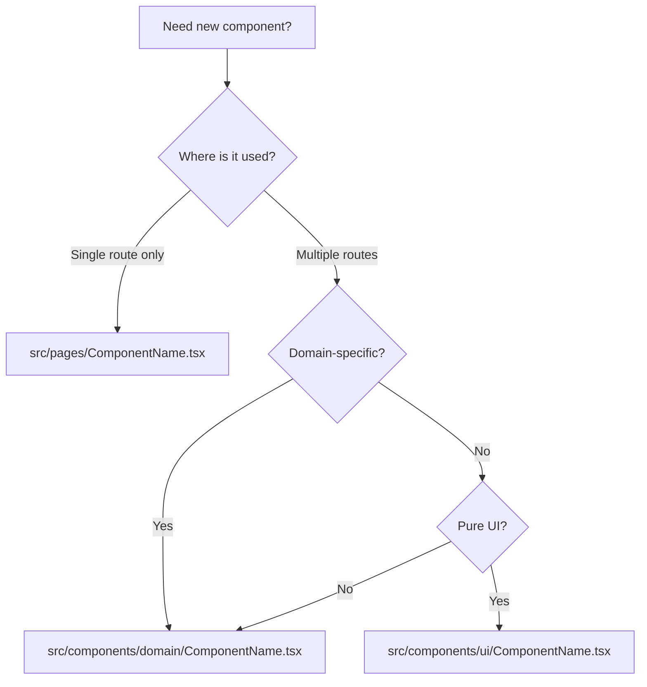

# Contributing Guide

Welcome to the Doc Aga project! This guide will help you get started with development and explain our coding standards and workflows.

## Table of Contents
1. [Getting Started](#1-getting-started)
2. [Development Workflow](#2-development-workflow)
3. [Code Style](#3-code-style)
4. [Testing Guidelines](#4-testing-guidelines)
5. [Component Guidelines](#5-component-guidelines)
6. [Chart Guidelines](#6-chart-guidelines)
7. [Database Changes](#7-database-changes)
8. [Edge Function Development](#8-edge-function-development)
9. [Common Patterns](#9-common-patterns)
10. [Debugging Tips](#10-debugging-tips)
11. [Performance Guidelines](#11-performance-guidelines)
12. [Security Guidelines](#12-security-guidelines)
13. [Deployment](#13-deployment)
14. [Resources](#14-resources)

---

## 1. Getting Started

### Prerequisites

**Required:**
- Node.js 18+ (recommended: use [nvm](https://github.com/nvm-sh/nvm))
- Git
- Code editor (VS Code recommended)

**Recommended VS Code Extensions:**
- ESLint
- Prettier
- TypeScript and JavaScript Language Features
- Tailwind CSS IntelliSense
- Error Lens

### Installation

```bash
# Clone the repository
git clone <repository-url>
cd doc-aga

# Install dependencies
npm install

# Start development server
npm run dev
```

The app will be available at `http://localhost:5173`

### Environment Setup

The `.env` file is **auto-generated** by Lovable Cloud. Do not edit it manually.

If you need to access Supabase credentials:
- They're pre-configured and managed automatically
- Check `.env` for connection details (view only)

### Project Structure Overview

```
doc-aga/
├── src/
│   ├── pages/              # Route-level components
│   ├── components/         # Reusable components
│   ├── hooks/              # Custom React hooks
│   ├── lib/                # Utilities & business logic
│   ├── integrations/       # External services (Supabase)
│   └── test-utils/         # Testing helpers
├── supabase/
│   ├── functions/          # Edge Functions (backend logic)
│   └── migrations/         # Database migrations
├── public/                 # Static assets
└── tests/                  # E2E tests (future)
```

---

## 2. Development Workflow

### Branch Strategy

```
main               # Production-ready code (protected)
├── feature/*      # New features
├── fix/*          # Bug fixes
├── refactor/*     # Code improvements
└── docs/*         # Documentation updates
```

**Branch Naming:**
- `feature/animal-weight-tracking`
- `fix/offline-sync-error`
- `refactor/farm-dashboard-split`
- `docs/update-architecture`

### Commit Guidelines

Follow [Conventional Commits](https://www.conventionalcommits.org/):

```
feat: add weight estimation for calves
fix: resolve offline queue sync issue
docs: update contributing guide
refactor: split FarmDashboard into smaller components
test: add tests for usePermissions hook
chore: update dependencies
```

**Commit Message Structure:**
```
<type>(<scope>): <subject>

<body>

<footer>
```

**Examples:**
```
feat(animals): add bulk import via CSV

Allows farmers to import multiple animals at once using CSV files.
Includes validation and error handling for invalid data.

Closes #123
```

```
fix(sync): prevent duplicate queue items

Added deduplication logic in offlineQueue.ts to prevent the same
activity from being queued multiple times.

Fixes #456
```

### Pull Request Process

1. **Create Feature Branch:**
   ```bash
   git checkout -b feature/my-new-feature
   ```

2. **Make Changes & Commit:**
   ```bash
   git add .
   git commit -m "feat: add new feature"
   ```

3. **Write/Update Tests:**
   ```bash
   npm test
   ```

4. **Push to Remote:**
   ```bash
   git push origin feature/my-new-feature
   ```

5. **Create Pull Request:**
   - Use descriptive title
   - Reference related issues
   - Add screenshots for UI changes
   - Fill out PR template

6. **Wait for CI/CD Checks:**
   - Tests must pass
   - Linting must pass
   - No merge conflicts

7. **Request Review:**
   - Tag relevant team members
   - Address feedback promptly

8. **Merge:**
   - Squash and merge (preferred)
   - Delete branch after merge

### Development Commands

```bash
npm run dev          # Start dev server
npm run build        # Build for production
npm run preview      # Preview production build
npm test             # Run tests
npm run test:watch   # Run tests in watch mode
npm run test:ui      # Open Vitest UI
npm run test:coverage # Generate coverage report
npm run lint         # Lint code (if configured)
```

---

## 3. Code Style

### TypeScript Guidelines

**✅ Do:**
```typescript
// Explicit types for function parameters and return values
function calculateAge(birthDate: Date): number {
  return Math.floor((Date.now() - birthDate.getTime()) / 31536000000);
}

// Use interfaces for object shapes
interface Animal {
  id: string;
  name: string;
  birthDate: Date;
}

// Use type guards for narrowing
function isAnimal(value: unknown): value is Animal {
  return (
    typeof value === 'object' &&
    value !== null &&
    'id' in value &&
    'name' in value
  );
}

// Use optional chaining and nullish coalescing
const name = animal?.name ?? 'Unknown';
```

**❌ Don't:**
```typescript
// Avoid 'any' type
function processData(data: any) { ... }  // ❌

// Don't skip types
function calculateAge(birthDate) { ... }  // ❌

// Don't mutate parameters
function updateAnimal(animal: Animal) {
  animal.name = 'New Name';  // ❌
}
```

### React Best Practices

**✅ Do:**
```typescript
// Functional components only
export const AnimalCard = ({ animal }: { animal: Animal }) => {
  return <div>{animal.name}</div>;
};

// Destructure props in signature
export const AnimalCard = ({ animal, onEdit, onDelete }: Props) => {
  // ...
};

// Use custom hooks for reusable logic
const useAnimalData = (farmId: string) => {
  return useQuery({
    queryKey: ['animals', farmId],
    queryFn: () => fetchAnimals(farmId)
  });
};

// Memoize expensive calculations
const lifeStage = useMemo(
  () => calculateLifeStage(animal.birthDate, animal.gender),
  [animal.birthDate, animal.gender]
);

// Memoize callbacks passed as props
const handleDelete = useCallback(
  (id: string) => deleteAnimal(id),
  [deleteAnimal]
);
```

**❌ Don't:**
```typescript
// No class components
class AnimalCard extends React.Component { ... }  // ❌

// Don't define functions inside JSX
<Button onClick={() => handleClick(id)}>Click</Button>  // ❌ (if re-renders often)

// Don't create objects/arrays inline (causes re-renders)
<Component items={[1, 2, 3]} />  // ❌ (in render)
```

### Naming Conventions

```typescript
// Components - PascalCase
AnimalForm.tsx
FarmDashboard.tsx
ProductCard.tsx

// Functions/Variables - camelCase
const calculateWeight = () => { };
const currentAnimal = getAnimal();

// Constants - UPPER_SNAKE_CASE
const MAX_RETRIES = 3;
const API_TIMEOUT = 5000;

// Types/Interfaces - PascalCase
interface AnimalFormData { }
type UserRole = 'admin' | 'farmer' | 'merchant';

// Private functions - prefix with underscore (optional)
const _internalHelper = () => { };

// Hooks - camelCase with 'use' prefix
useAnimalData()
usePermissions()
useRole()

// Boolean variables - prefix with 'is', 'has', 'can'
const isLoading = true;
const hasPermission = false;
const canEdit = true;
```

### File Structure Template

```typescript
// 1. Imports (grouped and ordered)
import { useState, useEffect, useMemo } from 'react';
import { useNavigate } from 'react-router-dom';
import { useQuery } from '@tanstack/react-query';

import { Button } from '@/components/ui/button';
import { Card } from '@/components/ui/card';

import { supabase } from '@/integrations/supabase/client';
import { calculateLifeStage } from '@/lib/animalStages';

import type { Animal } from '@/integrations/supabase/types';

// 2. Types/Interfaces
interface Props {
  animalId: string;
  onUpdate: (animal: Animal) => void;
}

// 3. Constants
const REFRESH_INTERVAL = 30000;

// 4. Component
export const AnimalDetails = ({ animalId, onUpdate }: Props) => {
  // 4a. Hooks (state, queries, etc.)
  const navigate = useNavigate();
  const [isEditing, setIsEditing] = useState(false);
  
  const { data: animal, isLoading } = useQuery({
    queryKey: ['animal', animalId],
    queryFn: () => fetchAnimal(animalId)
  });
  
  // 4b. Computed values
  const lifeStage = useMemo(
    () => animal ? calculateLifeStage(animal.birthDate, animal.gender) : null,
    [animal]
  );
  
  // 4c. Event handlers
  const handleEdit = useCallback(() => {
    setIsEditing(true);
  }, []);
  
  const handleSave = useCallback(async (data: Animal) => {
    await updateAnimal(data);
    onUpdate(data);
    setIsEditing(false);
  }, [onUpdate]);
  
  // 4d. Effects
  useEffect(() => {
    if (!animal) {
      navigate('/');
    }
  }, [animal, navigate]);
  
  // 4e. Loading/Error states
  if (isLoading) return <div>Loading...</div>;
  if (!animal) return null;
  
  // 4f. Render
  return (
    <Card>
      <h2>{animal.name}</h2>
      <p>Stage: {lifeStage}</p>
      <Button onClick={handleEdit}>Edit</Button>
    </Card>
  );
};

// 5. Helper functions (if component-specific)
const fetchAnimal = async (id: string): Promise<Animal> => {
  const { data, error } = await supabase
    .from('animals')
    .select('*')
    .eq('id', id)
    .single();
  
  if (error) throw error;
  return data;
};

const updateAnimal = async (animal: Animal): Promise<void> => {
  const { error } = await supabase
    .from('animals')
    .update(animal)
    .eq('id', animal.id);
  
  if (error) throw error;
};
```

### Import Order

```typescript
// 1. React core
import { useState, useEffect } from 'react';

// 2. Third-party libraries (alphabetically)
import { useQuery } from '@tanstack/react-query';
import { useForm } from 'react-hook-form';
import { zodResolver } from '@hookform/resolvers/zod';

// 3. Internal UI components
import { Button } from '@/components/ui/button';
import { Card } from '@/components/ui/card';

// 4. Internal feature components
import { AnimalForm } from '@/components/AnimalForm';

// 5. Hooks
import { usePermissions } from '@/hooks/usePermissions';
import { useRole } from '@/hooks/useRole';

// 6. Utilities
import { supabase } from '@/integrations/supabase/client';
import { calculateLifeStage } from '@/lib/animalStages';

// 7. Types
import type { Animal } from '@/integrations/supabase/types';

// 8. Styles (if any)
import './styles.css';
```

### JSDoc Documentation Standards

All utility functions, constants, and complex business logic **must** have JSDoc comments. This improves code maintainability, enables better IDE IntelliSense, and helps future developers understand the codebase.

**✅ Complete JSDoc Example:**

```typescript
/**
 * Calculate the life stage of a female cattle based on age and reproduction history
 * 
 * Determines developmental stage using industry-standard age thresholds and
 * reproductive milestones. Only applies to female cattle - returns null for males.
 * 
 * Life stages progression:
 * - **Calf** (0-8 months): Newborn to weaning
 * - **Heifer Calf** (8-12 months): Post-weaning growth
 * - **Breeding Heifer** (15+ months, no offspring): Ready for breeding
 * - **Mature Cow** (2+ offspring): Experienced mother
 * 
 * @param data - Animal stage data including birth date, gender, and reproduction info
 * @returns Life stage string or null if male/invalid data
 * 
 * @example
 * ```typescript
 * const stage = calculateLifeStage({
 *   birthDate: new Date('2023-06-01'),
 *   gender: 'Female',
 *   offspringCount: 0,
 *   hasActiveAI: false,
 *   // ... other fields
 * });
 * console.log(stage); // "Breeding Heifer" (16 months old)
 * ```
 * 
 * @throws {Error} If birthDate is invalid
 * @see {@link calculateMilkingStage} for lactation stage calculation
 */
export function calculateLifeStage(data: AnimalStageData): string | null {
  // Implementation...
}
```

**JSDoc Components:**

1. **Summary** (first line) - One-line description of function purpose
2. **Detailed Description** - Explain algorithm, edge cases, important notes
3. **`@param`** - Document each parameter with type and purpose
4. **`@returns`** - Describe what the function returns
5. **`@example`** - Show real-world usage with expected output
6. **`@throws`** (optional) - Document error conditions
7. **`@see`** (optional) - Link to related functions

**Files with Complete JSDoc:**

All utility files in `src/lib/` have comprehensive JSDoc:
- ✅ `utils.ts` - Tailwind merge utility
- ✅ `animalStages.ts` - Life/milking stage calculations
- ✅ `errorMessages.ts` - Error translation functions
- ✅ `expenseCategories.ts` - Expense & payment constants
- ✅ `livestockBreeds.ts` - Breed database
- ✅ `offlineQueue.ts` - IndexedDB queue operations
- ✅ `syncService.ts` - Queue synchronization
- ✅ `voiceQueueProcessor.ts` - Voice activity processing
- ✅ `dataCache.ts` - Offline cache management

**When to Write JSDoc:**

- ✅ All exported functions in `src/lib/`
- ✅ Complex algorithms or business logic
- ✅ Functions with non-obvious behavior
- ✅ Public APIs and interfaces
- ✅ Constants that need explanation

**When JSDoc is Optional:**

- Simple getters/setters
- Self-explanatory one-line functions
- Private helper functions (though still helpful)
- React component props (TypeScript types are sufficient)

---

## 4. Testing Guidelines

### When to Write Tests

**Must Test:**
- ✅ All utility functions in `src/lib/`
- ✅ Complex business logic
- ✅ Custom hooks
- ✅ Critical user flows
- ✅ Voice training components with audio recording mocks
- ✅ Network status indicator state transitions
- ✅ Conditional rendering patterns (auth route exclusion)

**Should Test:**
- ⚠️ Feature components with user interactions
- ⚠️ Form validation logic
- ⚠️ Data transformations

**Can Skip (for now):**
- ❌ Simple presentational components
- ❌ Shadcn UI components (already tested)
- ❌ Page components (until E2E tests are set up)

### Test Structure

```typescript
import { describe, it, expect, vi, beforeEach, afterEach } from 'vitest';
import { render, screen, waitFor } from '@testing-library/react';
import userEvent from '@testing-library/user-event';

describe('ComponentName', () => {
  // Setup/teardown
  beforeEach(() => {
    vi.clearAllMocks();
  });
  
  afterEach(() => {
    vi.restoreAllMocks();
  });
  
  it('should render correctly', () => {
    // Arrange
    const props = { name: 'Test' };
    
    // Act
    render(<Component {...props} />);
    
    // Assert
    expect(screen.getByText('Test')).toBeInTheDocument();
  });
  
  it('should handle user interaction', async () => {
    // Arrange
    const user = userEvent.setup();
    const onClickMock = vi.fn();
    render(<Button onClick={onClickMock}>Click me</Button>);
    
    // Act
    await user.click(screen.getByRole('button', { name: 'Click me' }));
    
    // Assert
    expect(onClickMock).toHaveBeenCalledTimes(1);
  });
  
  it('should handle async operations', async () => {
    // Arrange
    const mockData = { id: '1', name: 'Test Animal' };
    vi.mocked(supabase.from).mockReturnValue({
      select: vi.fn().mockReturnThis(),
      eq: vi.fn().mockResolvedValue({ data: mockData, error: null })
    } as any);
    
    // Act
    render(<AnimalDetails id="1" />);
    
    // Assert
    await waitFor(() => {
      expect(screen.getByText('Test Animal')).toBeInTheDocument();
    });
  });
});
```

### Testing Best Practices

**✅ Do:**
```typescript
// Test behavior, not implementation
it('should display error when email is invalid', async () => {
  const user = userEvent.setup();
  render(<LoginForm />);
  
  await user.type(screen.getByLabelText('Email'), 'invalid-email');
  await user.click(screen.getByRole('button', { name: 'Submit' }));
  
  expect(screen.getByText(/invalid email/i)).toBeInTheDocument();
});

// Use getByRole for accessibility
screen.getByRole('button', { name: 'Submit' });
screen.getByRole('textbox', { name: 'Email' });

// Mock external dependencies
vi.mock('@/integrations/supabase/client');

// Use descriptive test names
it('should disable submit button while form is submitting', ...);
```

**❌ Don't:**
```typescript
// Don't test implementation details
expect(component.state.isLoading).toBe(true);  // ❌

// Don't use getByTestId unless necessary
screen.getByTestId('submit-button');  // ❌ (use getByRole instead)

// Don't make tests dependent on each other
it('test 1', () => { globalVar = 'value'; });
it('test 2', () => { expect(globalVar).toBe('value'); });  // ❌
```

### Mocking Supabase

```typescript
import { vi } from 'vitest';
import { supabase } from '@/integrations/supabase/client';

// Mock the module
vi.mock('@/integrations/supabase/client');

// Mock authentication
vi.mocked(supabase.auth.getUser).mockResolvedValue({
  data: { user: { id: 'user-123', email: 'test@example.com' } },
  error: null
} as any);

// Mock queries
vi.mocked(supabase.from).mockReturnValue({
  select: vi.fn().mockReturnThis(),
  eq: vi.fn().mockResolvedValue({
    data: [{ id: '1', name: 'Test Animal' }],
    error: null
  })
} as any);

// Mock inserts
vi.mocked(supabase.from).mockReturnValue({
  insert: vi.fn().mockResolvedValue({
    data: { id: '1' },
    error: null
  })
} as any);
```

### Running Tests

```bash
# Run all tests once
npm test

# Watch mode (re-runs on file changes)
npm run test:watch

# Coverage report
npm run test:coverage

# Interactive UI
npm run test:ui
```

### Coverage Goals

**Current:** ~15-20% overall

**Short-term (3 months):**
- 100% coverage for `src/lib/` utilities
- 80% coverage for `src/hooks/`
- 40% coverage for `src/components/`

**Long-term (6 months):**
- 80% overall coverage
- E2E tests with Playwright
- Visual regression tests

---

## 5. Component Guidelines

### Conditional Component Rendering

Use the route-based conditional rendering pattern for global components that shouldn't appear on auth pages:

```tsx
import { useLocation } from 'react-router-dom';

const ConditionalFloatingComponents = () => {
  const location = useLocation();
  const authRoutes = ['/auth', '/auth/merchant', '/auth/admin'];
  const isAuthPage = authRoutes.includes(location.pathname);
  
  if (isAuthPage) return null;
  
  return (
    <>
      <FloatingDocAga />
      <FloatingVoiceTrainingButton />
    </>
  );
};
```

**When to use:**
- Global components that shouldn't appear on public/auth pages
- Floating buttons, chat widgets, notification systems
- Components that require authentication context
- Prevents cognitive overload during sign-up/login flows

### Creating New Components

**Decision Tree:**



**Examples:**
```
src/pages/FarmSetup.tsx              # Only used on /setup route
src/components/FarmDashboard.tsx     # Used across multiple farm pages
src/components/merchant/ProductList.tsx  # Merchant-specific
src/components/ui/button.tsx         # Pure UI (Shadcn)
```

### Component Checklist

Before committing a new component:

- [ ] Props interface is defined with TypeScript
- [ ] Loading states are handled
- [ ] Error states are handled
- [ ] Accessible (ARIA labels, keyboard navigation)
- [ ] Responsive design (mobile, tablet, desktop)
- [ ] Component is < 300 lines (refactor if larger)
- [ ] Tests written (if complex logic)
- [ ] No hardcoded strings (use constants for reusable text)

### Component Size Guidelines

```typescript
// ✅ Good: Focused component
export const AnimalCard = ({ animal }: Props) => {
  return (
    <Card>
      <h3>{animal.name}</h3>
      <p>{animal.breed}</p>
    </Card>
  );
};

// ⚠️ Too large: Consider splitting
export const FarmDashboard = () => {
  // 500+ lines of mixed concerns
  return (
    <>
      <StatsSection />
      <AnimalList />
      <Charts />
      <TeamManagement />
    </>
  );
};

// ✅ Better: Split into focused components
export const FarmDashboard = () => {
  return (
    <>
      <FarmStatsOverview />
      <AnimalListSection />
      <FarmChartsSection />
      <TeamManagementSection />
    </>
  );
};
```

### Extracting Logic to Hooks

```typescript
// ❌ Bad: Logic mixed with UI
export const AnimalList = () => {
  const [animals, setAnimals] = useState([]);
  const [loading, setLoading] = useState(true);
  
  useEffect(() => {
    const fetchData = async () => {
      setLoading(true);
      const { data } = await supabase.from('animals').select('*');
      setAnimals(data);
      setLoading(false);
    };
    fetchData();
  }, []);
  
  return <div>{/* Render animals */}</div>;
};

// ✅ Good: Logic in custom hook
const useAnimals = (farmId: string) => {
  return useQuery({
    queryKey: ['animals', farmId],
    queryFn: async () => {
      const { data, error } = await supabase
        .from('animals')
        .select('*')
        .eq('farm_id', farmId);
      if (error) throw error;
      return data;
    }
  });
};

export const AnimalList = ({ farmId }: Props) => {
  const { data: animals, isLoading } = useAnimals(farmId);
  
  if (isLoading) return <Skeleton />;
  return <div>{/* Render animals */}</div>;
};
```

---

## 6. Chart Guidelines

### Overview

All charts in Doc Aga use a unified responsive architecture built on Recharts. This ensures consistent mobile behavior, touch-friendly interactions, and maintainable code across all 15+ chart components.

### Architecture Components

| File | Purpose |
|------|---------|
| `src/lib/chartConfig.ts` | Centralized responsive configuration constants |
| `src/hooks/useResponsiveChart.ts` | Main hook providing responsive chart props |
| `src/components/charts/` | Reusable chart wrapper components |

### The useResponsiveChart Hook

This is the primary API for responsive charts. Import and use it in every chart component:

```typescript
import { useResponsiveChart } from "@/hooks/useResponsiveChart";

const { isMobile, fontSize, xAxisProps, legendProps, margin, shouldShowBrush, heightClass } = useResponsiveChart({
  size: 'medium',      // 'small' | 'medium' | 'large'
  dataLength: data.length,
  brushThreshold: 14,  // Show brush when data exceeds this (desktop only)
});
```

### Available Sizes

| Size | Mobile | Tablet | Desktop | Use Case |
|------|--------|--------|---------|----------|
| `small` | 200px | 240px | 280px | KPI cards, compact widgets |
| `medium` | 280px | 320px | 360px | Dashboard charts (default) |
| `large` | 320px | 380px | 420px | Full-page analytics |

### Hook Return Values

| Property | Type | Description |
|----------|------|-------------|
| `isMobile` | boolean | True on screens < 768px |
| `fontSize` | number | 9px (mobile) or 11px (desktop) |
| `heightClass` | string | Tailwind height classes for responsive sizing |
| `xAxisProps` | object | Spread onto XAxis: angle, height, tickMargin, interval |
| `legendProps` | object | Spread onto Legend: wrapperStyle, iconSize |
| `margin` | object | Chart margins: { top, right, bottom, left } |
| `shouldShowBrush` | boolean | True when data > threshold AND on desktop |

### Standard Chart Template

```typescript
import { ChartContainer } from "@/components/ui/chart";
import { AreaChart, Area, XAxis, YAxis, Tooltip, Legend } from "recharts";
import { useResponsiveChart } from "@/hooks/useResponsiveChart";

export const MyChart = ({ data }: { data: DataPoint[] }) => {
  const { isMobile, fontSize, xAxisProps, legendProps, margin, heightClass } = useResponsiveChart({
    size: 'medium',
    dataLength: data.length,
  });

  const chartConfig = {
    value: { label: "Value", color: "hsl(var(--chart-1))" },
  };

  return (
    <ChartContainer config={chartConfig} className={`aspect-auto w-full ${heightClass}`}>
      <AreaChart data={data} margin={margin}>
        <XAxis dataKey="date" tick={{ fontSize }} {...xAxisProps} />
        <YAxis tick={{ fontSize }} />
        <Tooltip />
        <Legend 
          wrapperStyle={legendProps.wrapperStyle} 
          iconSize={legendProps.iconSize} 
        />
        <Area dataKey="value" fill="var(--color-value)" />
      </AreaChart>
    </ChartContainer>
  );
};
```

### Mobile Optimizations Applied Automatically

- **XAxis rotation**: Labels rotate -45 degrees on mobile for readability
- **Increased bottom margin**: Accommodates rotated labels (100px vs 60px)
- **Smaller fonts**: 9px on mobile vs 11px on desktop
- **No Brush on mobile**: Touch-unfriendly brush component hidden
- **Compact legends**: Smaller icons and font in legend

### Adding Conditional Brush (Desktop Only)

For charts with many data points, add a zoom/pan brush control:

```typescript
const { shouldShowBrush } = useResponsiveChart({
  size: 'medium',
  dataLength: data.length,
  brushThreshold: 14, // Shows brush when data.length > 14 AND not mobile
});

// In render:
{shouldShowBrush && (
  <Brush 
    dataKey="date" 
    height={30} 
    stroke="hsl(var(--border))" 
    fill="hsl(var(--muted))"
  />
)}
```

### Important: Recharts Container Limitation

**The Recharts chart component (AreaChart, BarChart, etc.) MUST be the direct child of ChartContainer.**

Intermediate wrapper components break the responsive sizing:

```typescript
// ❌ WRONG - chart won't receive dimensions
<ChartContainer>
  <MyChartWrapper>   {/* Blocks cloneElement injection */}
    <AreaChart>...</AreaChart>
  </MyChartWrapper>
</ChartContainer>

// ✅ CORRECT - direct child
<ChartContainer>
  <AreaChart>...</AreaChart>  {/* Receives width/height */}
</ChartContainer>
```

### Chart Type Quick Reference

| Chart Type | Common Components | Notes |
|------------|-------------------|-------|
| Line/Area | XAxis, YAxis, Tooltip, Legend, Area/Line | Use gradient fills |
| Bar | XAxis, YAxis, Tooltip, Legend, Bar | Use stackId for stacked |
| Pie | Pie, Cell, Tooltip, Legend | No XAxis/YAxis needed |
| Composed | XAxis, YAxis, Bar + Line | Combine multiple types |

### Checklist for New Charts

- [ ] Import `useResponsiveChart` hook
- [ ] Set appropriate `size` ('small' for widgets, 'medium' for dashboards)
- [ ] Pass `dataLength` for brush threshold calculation
- [ ] Apply `heightClass` to ChartContainer
- [ ] Spread `xAxisProps` onto XAxis component
- [ ] Apply `fontSize` to XAxis and YAxis tick props
- [ ] Spread `legendProps` onto Legend component
- [ ] Apply `margin` to chart component
- [ ] Conditionally render Brush using `shouldShowBrush`

---

## 7. Database Changes

### Migration Best Practices

**⚠️ Critical Rules:**
- ❌ **NEVER** edit `src/integrations/supabase/types.ts` manually (auto-generated)
- ✅ **ALWAYS** create migrations through Lovable Cloud UI
- ✅ **ALWAYS** test migrations locally before production
- ✅ Include rollback plan in migration comments

### Migration Workflow

1. **Plan Changes:**
   - Document table schema changes
   - Plan RLS policies
   - Consider data migration for existing records

2. **Create Migration:**
   - Use Lovable Cloud UI to generate migration SQL
   - Review generated SQL carefully
   - Add comments explaining the change

3. **Test Locally:**
   - Apply migration to local database
   - Test with sample data
   - Verify RLS policies work as expected

4. **Deploy:**
   - Lovable automatically applies migration on push
   - Monitor for errors in logs
   - Verify in production database

### RLS Policy Checklist

For every table you create:

- [ ] RLS is enabled: `ALTER TABLE table_name ENABLE ROW LEVEL SECURITY;`
- [ ] SELECT policy (who can read data)
- [ ] INSERT policy (who can create data)
- [ ] UPDATE policy (who can modify data)
- [ ] DELETE policy (who can remove data)
- [ ] Policies tested with different user roles
- [ ] Policies use security definer functions (avoid recursion)

### Example Migration

```sql
-- Migration: Add animal photos support
-- Date: 2025-01-15

-- 1. Create table
CREATE TABLE IF NOT EXISTS public.animal_photos (
  id UUID PRIMARY KEY DEFAULT gen_random_uuid(),
  animal_id UUID NOT NULL REFERENCES public.animals(id) ON DELETE CASCADE,
  farm_id UUID NOT NULL REFERENCES public.farms(id) ON DELETE CASCADE,
  photo_url TEXT NOT NULL,
  caption TEXT,
  created_at TIMESTAMPTZ DEFAULT now(),
  created_by UUID NOT NULL REFERENCES auth.users(id)
);

-- 2. Enable RLS
ALTER TABLE public.animal_photos ENABLE ROW LEVEL SECURITY;

-- 3. Create policies
CREATE POLICY "Farm members can view animal photos"
  ON public.animal_photos
  FOR SELECT
  USING (public.can_access_farm(farm_id));

CREATE POLICY "Farm members can upload animal photos"
  ON public.animal_photos
  FOR INSERT
  WITH CHECK (public.can_access_farm(farm_id));

CREATE POLICY "Photo uploader can delete their photos"
  ON public.animal_photos
  FOR DELETE
  USING (created_by = auth.uid() OR public.is_farm_owner(auth.uid(), farm_id));

-- 4. Create index for performance
CREATE INDEX idx_animal_photos_animal_id ON public.animal_photos(animal_id);
CREATE INDEX idx_animal_photos_farm_id ON public.animal_photos(farm_id);

-- 5. Add trigger for timestamp updates (if needed)
CREATE TRIGGER update_animal_photos_updated_at
  BEFORE UPDATE ON public.animal_photos
  FOR EACH ROW
  EXECUTE FUNCTION public.handle_timestamp();

-- Rollback plan:
-- DROP TABLE IF EXISTS public.animal_photos CASCADE;
```

### Security Considerations

**✅ Do:**
```sql
-- Use security definer functions
CREATE OR REPLACE FUNCTION public.can_delete_animal(_animal_id UUID)
RETURNS BOOLEAN
LANGUAGE SQL
STABLE SECURITY DEFINER
SET search_path = public
AS $$
  SELECT EXISTS (
    SELECT 1 FROM public.animals a
    JOIN public.farms f ON f.id = a.farm_id
    WHERE a.id = _animal_id
      AND (f.owner_id = auth.uid() OR public.has_role(auth.uid(), 'admin'))
  );
$$;

-- Use the function in policies
CREATE POLICY "Owners can delete animals"
  ON public.animals
  FOR DELETE
  USING (public.can_delete_animal(id));
```

**❌ Don't:**
```sql
-- Don't query the same table in RLS policy (causes recursion)
CREATE POLICY "Bad policy"
  ON public.animals
  FOR SELECT
  USING (
    -- ❌ This queries animals table, causing infinite recursion
    (SELECT farm_id FROM public.animals WHERE id = id) IN (
      SELECT farm_id FROM farm_memberships WHERE user_id = auth.uid()
    )
  );
```

---

## 8. Edge Function Development

### Creating Edge Functions

**Folder Structure:**
```
supabase/functions/
├── my-function/
│   ├── index.ts          # Main handler
│   ├── types.ts          # Type definitions (optional)
│   └── utils.ts          # Helper functions (optional)
```

**Template:**
```typescript
// supabase/functions/my-function/index.ts
import { serve } from 'https://deno.land/std@0.168.0/http/server.ts';
import { createClient } from 'https://esm.sh/@supabase/supabase-js@2';

const corsHeaders = {
  'Access-Control-Allow-Origin': '*',
  'Access-Control-Allow-Headers': 'authorization, x-client-info, apikey, content-type',
};

serve(async (req) => {
  // Handle CORS preflight
  if (req.method === 'OPTIONS') {
    return new Response('ok', { headers: corsHeaders });
  }

  try {
    // 1. Authenticate user
    const authHeader = req.headers.get('Authorization');
    if (!authHeader) {
      throw new Error('Missing authorization header');
    }

    const supabaseClient = createClient(
      Deno.env.get('SUPABASE_URL') ?? '',
      Deno.env.get('SUPABASE_ANON_KEY') ?? '',
      { global: { headers: { Authorization: authHeader } } }
    );

    const { data: { user }, error: userError } = await supabaseClient.auth.getUser();
    if (userError || !user) {
      throw new Error('Unauthorized');
    }

    // 2. Parse and validate input
    const body = await req.json();
    // TODO: Validate with Zod

    // 3. Implement business logic
    const result = await doSomething(body, user.id);

    // 4. Return response
    return new Response(
      JSON.stringify({ success: true, data: result }),
      { headers: { ...corsHeaders, 'Content-Type': 'application/json' } }
    );

  } catch (error) {
    console.error('Error:', error);
    
    // Return sanitized error
    return new Response(
      JSON.stringify({ error: 'An error occurred processing your request' }),
      { 
        status: 500,
        headers: { ...corsHeaders, 'Content-Type': 'application/json' }
      }
    );
  }
});
```

### Edge Function Checklist

Before deploying an edge function:

- [ ] CORS headers configured
- [ ] JWT authentication implemented (unless public webhook)
- [ ] Input validation with Zod
- [ ] Rate limiting added (if needed)
- [ ] Error messages sanitized (no sensitive data leaked)
- [ ] Structured logging for debugging
- [ ] Environment variables used for secrets
- [ ] Tests written (manual testing minimum)

### Rate Limiting Example

```typescript
// Simple in-memory rate limiting (for development)
const rateLimitMap = new Map<string, number[]>();

const checkRateLimit = (userId: string, limit = 15): boolean => {
  const now = Date.now();
  const windowMs = 60000; // 1 minute
  
  const userRequests = rateLimitMap.get(userId) || [];
  const recentRequests = userRequests.filter(time => now - time < windowMs);
  
  if (recentRequests.length >= limit) {
    return false; // Rate limit exceeded
  }
  
  recentRequests.push(now);
  rateLimitMap.set(userId, recentRequests);
  return true;
};

// Usage in edge function
if (!checkRateLimit(user.id, 15)) {
  throw new Error('Rate limit exceeded. Please try again later.');
}
```

### Input Validation with Zod

```typescript
import { z } from 'https://esm.sh/zod@3.22.4';

const RequestSchema = z.object({
  message: z.string().min(1).max(1000),
  farmId: z.string().uuid(),
  animalId: z.string().uuid().optional()
});

// Validate request body
const body = await req.json();
const validatedData = RequestSchema.parse(body); // Throws if invalid

// Now use validatedData safely
console.log(validatedData.message);
```

### Deployment

Edge functions are **automatically deployed** when you push to the main branch. No manual steps needed.

To test locally:
```bash
# Serve function locally
supabase functions serve my-function --no-verify-jwt

# Test with curl
curl -X POST http://localhost:54321/functions/v1/my-function \
  -H "Authorization: Bearer YOUR_TOKEN" \
  -H "Content-Type: application/json" \
  -d '{"message": "test"}'
```

---

## 9. Common Patterns

### Data Fetching with TanStack Query

```typescript
// Custom hook pattern
export const useAnimals = (farmId: string) => {
  return useQuery({
    queryKey: ['animals', farmId],
    queryFn: async () => {
      const { data, error } = await supabase
        .from('animals')
        .select('*')
        .eq('farm_id', farmId)
        .order('created_at', { ascending: false });
      
      if (error) throw error;
      return data;
    },
    enabled: !!farmId, // Only fetch if farmId exists
    staleTime: 5 * 60 * 1000, // 5 minutes
  });
};

// Usage in component
const { data: animals, isLoading, error } = useAnimals(farmId);
```

### Data Mutations

```typescript
export const useCreateAnimal = () => {
  const queryClient = useQueryClient();
  
  return useMutation({
    mutationFn: async (newAnimal: Omit<Animal, 'id'>) => {
      const { data, error } = await supabase
        .from('animals')
        .insert(newAnimal)
        .select()
        .single();
      
      if (error) throw error;
      return data;
    },
    onSuccess: (data) => {
      // Invalidate queries to refetch
      queryClient.invalidateQueries({ queryKey: ['animals', data.farm_id] });
      
      // Show success toast
      toast({
        title: 'Success',
        description: 'Animal added successfully',
      });
    },
    onError: (error) => {
      // Show error toast
      toast({
        title: 'Error',
        description: error.message,
        variant: 'destructive',
      });
    }
  });
};

// Usage
const createAnimal = useCreateAnimal();

const handleSubmit = (formData: AnimalFormData) => {
  createAnimal.mutate(formData);
};
```

### Form Handling

```typescript
import { useForm } from 'react-hook-form';
import { zodResolver } from '@hookform/resolvers/zod';
import { z } from 'zod';

// Define schema
const animalSchema = z.object({
  name: z.string().min(1, 'Name is required'),
  ear_tag: z.string().min(1, 'Ear tag is required'),
  breed: z.string().optional(),
  birth_date: z.string().optional(),
});

type AnimalFormData = z.infer<typeof animalSchema>;

// Component
export const AnimalForm = () => {
  const form = useForm<AnimalFormData>({
    resolver: zodResolver(animalSchema),
    defaultValues: {
      name: '',
      ear_tag: '',
    }
  });

  const onSubmit = async (data: AnimalFormData) => {
    // Handle submission
    await createAnimal(data);
  };

  return (
    <Form {...form}>
      <form onSubmit={form.handleSubmit(onSubmit)}>
        <FormField
          control={form.control}
          name="name"
          render={({ field }) => (
            <FormItem>
              <FormLabel>Name</FormLabel>
              <FormControl>
                <Input {...field} />
              </FormControl>
              <FormMessage />
            </FormItem>
          )}
        />
        <Button type="submit">Submit</Button>
      </form>
    </Form>
  );
};
```

### Offline Queue Pattern

```typescript
import { addToQueue, getPendingCount } from '@/lib/offlineQueue';
import { syncQueue } from '@/lib/syncService';

// Add activity to queue
const handleOfflineSubmit = async (formData: FormData) => {
  await addToQueue({
    id: crypto.randomUUID(),
    type: 'animal_form',
    payload: { formData },
    createdAt: Date.now(),
    status: 'pending'
  });
  
  toast({
    title: 'Saved Offline',
    description: 'Activity will sync when you\'re back online'
  });
};

// Check for pending items
const { data: pendingCount } = useQuery({
  queryKey: ['offline-queue-count'],
  queryFn: getPendingCount,
  refetchInterval: 5000 // Poll every 5 seconds
});

// Trigger sync manually
const handleSync = async () => {
  await syncQueue();
};
```

### Voice Recording and Upload Pattern

For recording and uploading voice samples:

```typescript
import { useState } from 'react';
import { supabase } from '@/integrations/supabase/client';
import { toast } from 'sonner';

const VoiceRecorder = () => {
  const [isRecording, setIsRecording] = useState(false);
  const [audioBlob, setAudioBlob] = useState<Blob | null>(null);

  const startRecording = async () => {
    const stream = await navigator.mediaDevices.getUserMedia({ audio: true });
    const mediaRecorder = new MediaRecorder(stream);
    
    const chunks: Blob[] = [];
    mediaRecorder.ondataavailable = (e) => chunks.push(e.data);
    mediaRecorder.onstop = () => {
      const blob = new Blob(chunks, { type: 'audio/webm' });
      setAudioBlob(blob);
    };
    
    mediaRecorder.start();
    setIsRecording(true);
  };

  const uploadSample = async (audio: Blob, text: string, language: string) => {
    const reader = new FileReader();
    reader.readAsDataURL(audio);
    reader.onloadend = async () => {
      const base64Audio = reader.result?.toString().split(',')[1];
      const { data: { user } } = await supabase.auth.getUser();
      
      const { error } = await supabase.functions.invoke('process-voice-training', {
        body: { 
          audio: base64Audio, 
          sampleText: text, 
          language: language,
          userId: user?.id 
        }
      });
      
      if (error) {
        toast.error('Upload failed');
      } else {
        toast.success('Sample recorded successfully');
      }
    };
  };
  
  return (
    // UI implementation
  );
};
```

### Network Status Monitoring Pattern

For displaying connection status with visual feedback:

```typescript
import { useOnlineStatus } from "@/hooks/useOnlineStatus";
import { 
  Tooltip, 
  TooltipContent, 
  TooltipTrigger, 
  TooltipProvider 
} from "@/components/ui/tooltip";
import { cn } from "@/lib/utils";

const NetworkStatusIndicator = () => {
  const { isOnline, pendingCount } = useOnlineStatus();
  
  return (
    <TooltipProvider>
      <Tooltip>
        <TooltipTrigger>
          <div className={cn(
            "h-3 w-3 rounded-full transition-colors",
            isOnline ? "bg-green-500" : "bg-red-500",
            pendingCount > 0 && "bg-yellow-500 animate-pulse"
          )} />
        </TooltipTrigger>
        <TooltipContent>
          {isOnline ? "Online" : "Offline"}
          {pendingCount > 0 && ` - ${pendingCount} pending operations`}
        </TooltipContent>
      </Tooltip>
    </TooltipProvider>
  );
};
```

### User Experience Patterns

**Voice-First Defaults:**
```typescript
// Set voice as default input method for new users
useEffect(() => {
  const currentMethod = localStorage.getItem('docAgaInputMethod');
  if (!currentMethod) {
    localStorage.setItem('docAgaInputMethod', 'voice');
  }
}, []);
```

**Benefits:**
- Aligns with mobile-first, hands-free farming workflow
- Reduces friction for voice-first users
- Users can override and preference is saved

**Non-Intrusive Status Indicators:**
- Use circular icons instead of full-width banners
- Place in header/navbar for consistent visibility
- Add tooltips for detailed information on hover
- Color coding: green (success), red (error), yellow (warning/in-progress)
- Smooth transitions with Tailwind animations

**Floating Component Strategy:**
- Conditionally render based on route context
- Hide on auth pages to reduce cognitive load during sign-up/login
- Use `useLocation()` from react-router-dom to detect current page
- Keep components accessible but not distracting
- Example: `FloatingDocAga`, `FloatingVoiceTrainingButton`

### Farmhand Approval Queue Pattern

Activities submitted by farmhands go through an approval queue before affecting production records:

```typescript
// Submit activity to pending queue (not directly to records)
const submitForApproval = async (activityData: ActivityData) => {
  const { error } = await supabase.from('pending_activities').insert({
    farm_id: farmId,
    submitted_by: userId,
    activity_type: 'feeding', // or 'milking', 'health', etc.
    activity_data: activityData, // Includes pre-calculated distributions
    animal_ids: selectedAnimalIds,
    status: 'pending',
    auto_approve_at: calculateAutoApproveTime(farmId) // From farm_approval_settings
  });
};

// Managers review via review-pending-activity edge function
// Auto-approval runs via process-auto-approvals cron job
```

### Weight-Proportional Feed Distribution Pattern

Bulk feeding must calculate proportional distributions BEFORE queuing:

```typescript
// Calculate weight-proportional feed distribution
const calculateFeedDistribution = (
  animals: Animal[], 
  totalFeedKg: number
): FeedDistribution[] => {
  const totalWeight = animals.reduce((sum, a) => sum + (a.current_weight_kg || 0), 0);
  
  return animals.map(animal => ({
    animal_id: animal.id,
    kilograms: totalWeight > 0 
      ? (animal.current_weight_kg || 0) / totalWeight * totalFeedKg
      : totalFeedKg / animals.length // Fallback to equal distribution
  }));
};

// Include distribution in activity_data for approval
const activityData = {
  feed_type: 'Napier Grass',
  total_kg: 50,
  distribution: calculateFeedDistribution(selectedAnimals, 50)
};
```

### Inventory Deduction on Approval Pattern

Feed inventory is deducted when activities are approved (not when submitted):

```typescript
// In review-pending-activity or process-auto-approvals
const deductFeedInventory = async (farmId: string, activityData: any) => {
  // FIFO strategy: deduct from oldest inventory first
  const { data: inventory } = await supabase
    .from('feed_inventory')
    .select('*')
    .eq('farm_id', farmId)
    .eq('feed_type', activityData.feed_type)
    .order('created_at', { ascending: true }); // FIFO
  
  let remainingToDeduct = activityData.total_kg;
  
  for (const item of inventory) {
    if (remainingToDeduct <= 0) break;
    
    const deduction = Math.min(item.quantity_kg, remainingToDeduct);
    await supabase.from('feed_inventory')
      .update({ quantity_kg: item.quantity_kg - deduction })
      .eq('id', item.id);
    
    // Create transaction record for audit trail
    await supabase.from('feed_stock_transactions').insert({
      feed_inventory_id: item.id,
      quantity_change_kg: -deduction,
      transaction_type: 'consumption',
      notes: 'Approved feeding activity'
    });
    
    remainingToDeduct -= deduction;
  }
};
```

### Clarification Flow Pattern

When voice input is ambiguous, return structured clarification instead of errors:

```typescript
// In edge function response
if (!feedType && feedInventory.length > 1) {
  return {
    error: 'NEEDS_CLARIFICATION',
    message: 'Which type of feed did you use?',
    availableOptions: feedInventory.map(f => f.feed_type),
    context: 'feed_type_selection'
  };
}

// Frontend handles clarification response
if (response.error === 'NEEDS_CLARIFICATION') {
  // Show selection UI with availableOptions
  setShowClarificationDialog(true);
  setClarificationOptions(response.availableOptions);
}
```

---

## 10. Debugging Tips

### Common Issues & Solutions

#### 1. **Supabase RLS Errors**

**Symptom:** Query returns empty or throws permission error

**Debug Steps:**
```typescript
// Check if user is authenticated
const { data: { user } } = await supabase.auth.getUser();
console.log('Current user:', user);

// Check user roles
const { data: roles } = await supabase
  .from('user_roles')
  .select('role')
  .eq('user_id', user?.id);
console.log('User roles:', roles);

// Test RLS policy directly
const { data: hasAccess } = await supabase
  .rpc('can_access_farm', { fid: farmId });
console.log('Farm access:', hasAccess);
```

**Common Fixes:**
- Ensure user is authenticated
- Check RLS policies on table
- Verify user has required role
- Use security definer functions to avoid recursion

#### 2. **TypeScript Type Errors**

**Symptom:** Type errors in Supabase queries

**Solution:**
```typescript
// The types file is auto-generated, don't edit it
// If types are out of date, they auto-update from Lovable Cloud

// Use type assertion when needed
const animal = data as Animal;

// Or use type guards
function isAnimal(value: unknown): value is Animal {
  return (
    typeof value === 'object' &&
    value !== null &&
    'id' in value &&
    'name' in value
  );
}
```

#### 3. **Offline Sync Issues**

**Debug Steps:**
```typescript
// Check IndexedDB in DevTools
// Chrome: DevTools → Application → IndexedDB → docAgaOfflineDB

// View queue items
import { getAll } from '@/lib/offlineQueue';
const items = await getAll();
console.log('Queue items:', items);

// Check sync service logs
// Look for errors in console during sync

// Manually trigger sync
import { syncQueue } from '@/lib/syncService';
await syncQueue();
```

#### 4. **Component Not Updating**

**Symptom:** Data changes but UI doesn't update

**Debug Steps:**
```typescript
// Check TanStack Query cache
import { useQueryClient } from '@tanstack/react-query';
const queryClient = useQueryClient();

// View cached data
const cachedData = queryClient.getQueryData(['animals', farmId]);
console.log('Cached:', cachedData);

// Invalidate to force refetch
queryClient.invalidateQueries({ queryKey: ['animals', farmId] });
```

### Browser DevTools Tips

**React DevTools:**
- Inspect component props and state
- View hooks in order they're called
- Profile component renders

**Network Tab:**
- Monitor Supabase API calls
- Check request/response payloads
- Verify authentication headers

**Console:**
- Use `console.table()` for array data
- Use `console.dir()` for objects
- Set breakpoints with `debugger;`

**Application Tab:**
- View localStorage/sessionStorage
- Inspect IndexedDB databases
- Check service workers

---

## 11. Performance Guidelines

### Do's

**✅ Memoize Expensive Calculations:**
```typescript
const lifeStage = useMemo(
  () => calculateLifeStage(animal.birthDate, animal.gender),
  [animal.birthDate, animal.gender]
);
```

**✅ Memoize Callbacks:**
```typescript
const handleDelete = useCallback(
  (id: string) => deleteAnimal(id),
  [deleteAnimal]
);
```

**✅ Use TanStack Query Caching:**
```typescript
const { data } = useQuery({
  queryKey: ['animals', farmId],
  queryFn: () => fetchAnimals(farmId),
  staleTime: 5 * 60 * 1000, // Cache for 5 minutes
});
```

**✅ Optimize Images:**
```typescript
// Use WebP format


// Lazy load images


// Responsive images

```

**✅ Debounce User Input:**
```typescript
import { useDebouncedValue } from '@/hooks/useDebounce';

const [search, setSearch] = useState('');
const debouncedSearch = useDebouncedValue(search, 300);

useQuery({
  queryKey: ['animals', debouncedSearch],
  queryFn: () => searchAnimals(debouncedSearch),
  enabled: debouncedSearch.length > 0
});
```

### Don'ts

**❌ Don't Fetch Data in Loops:**
```typescript
// Bad
for (const animal of animals) {
  const records = await fetchRecords(animal.id); // ❌
}

// Good
const animalIds = animals.map(a => a.id);
const records = await fetchRecordsBatch(animalIds); // ✅
```

**❌ Don't Mutate State Directly:**
```typescript
// Bad
animals[0].name = 'New Name'; // ❌
setAnimals(animals);

// Good
setAnimals(prev => 
  prev.map(a => a.id === id ? { ...a, name: 'New Name' } : a)
); // ✅
```

**❌ Don't Create Objects/Arrays Inline:**
```typescript
// Bad (causes re-render on every parent render)
<Component config={{ timeout: 5000 }} /> // ❌

// Good
const config = useMemo(() => ({ timeout: 5000 }), []);
<Component config={config} /> // ✅
```

---

## 12. Security Guidelines

### Frontend Security

**✅ Do:**
- Validate all user input before submission
- Use HTTPS only (enforced by Lovable)
- Sanitize user-generated content before display
- Implement rate limiting on forms (client-side)
- Never store sensitive data in localStorage

**❌ Don't:**
- Don't trust client-side validation alone
- Don't expose API keys in frontend code
- Don't bypass authentication checks
- Don't hardcode credentials

### Backend Security (Edge Functions)

**✅ Required:**
```typescript
// 1. JWT Authentication
const authHeader = req.headers.get('Authorization');
if (!authHeader) throw new Error('Unauthorized');

const { data: { user }, error } = await supabaseClient.auth.getUser();
if (error || !user) throw new Error('Unauthorized');

// 2. Input Validation
const RequestSchema = z.object({
  farmId: z.string().uuid(),
  message: z.string().min(1).max(1000)
});
const validated = RequestSchema.parse(body);

// 3. Rate Limiting
if (!checkRateLimit(user.id, 15)) {
  throw new Error('Rate limit exceeded');
}

// 4. Sanitized Errors
catch (error) {
  console.error('Detailed error:', error); // Log for debugging
  return new Response(
    JSON.stringify({ error: 'An error occurred' }), // Generic message
    { status: 500 }
  );
}
```

### Database Security

**✅ RLS Policies:**
- Enable RLS on all tables
- Use security definer functions
- Test policies with different user roles
- Never expose sensitive data to unauthorized users

**✅ Securing Database Views:**
Views can bypass RLS by default. Use this pattern for sensitive views:

```sql
-- 1. Create view with security_invoker to enforce caller's RLS
CREATE OR REPLACE VIEW public.sensitive_data_view
WITH (security_invoker = true)
AS SELECT ... FROM sensitive_table;

-- 2. Revoke direct access from anonymous/public roles
REVOKE ALL ON public.sensitive_data_view FROM anon;
REVOKE ALL ON public.sensitive_data_view FROM public;

-- 3. Create role-gated RPC function as the access layer
CREATE OR REPLACE FUNCTION public.get_sensitive_data()
RETURNS SETOF public.sensitive_data_view
LANGUAGE plpgsql
SECURITY DEFINER
SET search_path = public
AS $$
BEGIN
  -- Validate caller has required role
  IF NOT (has_role(auth.uid(), 'admin'::user_role) OR 
          has_role(auth.uid(), 'government'::user_role)) THEN
    RAISE EXCEPTION 'Access denied: Required role not found';
  END IF;
  
  RETURN QUERY SELECT * FROM sensitive_data_view;
END;
$$;

-- 4. Revoke direct function execution from public
REVOKE EXECUTE ON FUNCTION get_sensitive_data() FROM anon, public;
GRANT EXECUTE ON FUNCTION get_sensitive_data() TO authenticated;
```

**✅ Webhook Security:**
```typescript
// Verify webhook signatures
import { createHmac } from 'crypto';

const verifySignature = (payload: string, signature: string, secret: string) => {
  const hmac = createHmac('sha256', secret);
  hmac.update(payload);
  const expectedSignature = hmac.digest('hex');
  return signature === expectedSignature;
};
```

---

## 13. Deployment

### Lovable Deployment

**Automatic Deployment:**
- Push to main branch → Auto-deploy
- No manual steps needed
- Deployments are immediate

**Manual Deployment:**
- Use Lovable UI "Publish" button
- Deploys latest main branch

**Verification:**
1. Check staging URL: `https://your-project.lovableproject.com`
2. Test critical flows (login, data CRUD)
3. Check console for errors
4. Verify database migrations applied

### Android Deployment

**1. Update Version Numbers:**
```json
// package.json
{
  "version": "1.0.2"
}
```

```gradle
// android/app/build.gradle
android {
  defaultConfig {
    versionCode 3        // Increment by 1 each release
    versionName "1.0.2"  // Match package.json
  }
}
```

**2. Build Process:**
```bash
# 1. Build web app
npm run build

# 2. Sync to Android
npx cap sync android

# 3. Open Android Studio
npx cap open android

# 4. In Android Studio:
# - Build → Generate Signed Bundle/APK
# - Select "Android App Bundle" (AAB)
# - Choose release key
# - Build
```

**3. Upload to Google Play:**
- Go to Google Play Console
- Select app → Production → Create new release
- Upload AAB file
- Add release notes
- Review and publish

**4. Rollout Strategy:**
- Start with 10% rollout
- Monitor for crashes/errors
- Increase to 50%, then 100%

---

## 14. Resources

### Documentation

**Official Docs:**
- [Lovable Docs](https://docs.lovable.dev/)
- [Supabase Docs](https://supabase.com/docs)
- [TanStack Query](https://tanstack.com/query/latest)
- [React Hook Form](https://react-hook-form.com/)
- [Zod](https://zod.dev/)
- [Shadcn/ui](https://ui.shadcn.com/)
- [Tailwind CSS](https://tailwindcss.com/docs)
- [Capacitor](https://capacitorjs.com/docs)

**Learning Resources:**
- [React TypeScript Cheatsheet](https://react-typescript-cheatsheet.netlify.app/)
- [TypeScript Deep Dive](https://basarat.gitbook.io/typescript/)
- [Testing Library Best Practices](https://kentcdodds.com/blog/common-mistakes-with-react-testing-library)

### Tools

**VS Code Extensions:**
- ESLint
- Prettier
- TypeScript and JavaScript Language Features
- Tailwind CSS IntelliSense
- Error Lens
- GitLens

**Browser Extensions:**
- React Developer Tools
- Redux DevTools (for state debugging)

**CLI Tools:**
```bash
# Supabase CLI
npm install -g supabase

# Generate types from database
supabase gen types typescript --project-id <project-id> > types.ts
```

### Community

- **Discord**: [Lovable Discord](https://discord.gg/lovable)
- **GitHub Issues**: Report bugs and feature requests
- **Team Slack**: Internal communication

---

## Conclusion

Thank you for contributing to Doc Aga! 🎉

**Key Takeaways:**
- ✅ Always write tests for new features
- ✅ Keep components small and focused
- ✅ Use TypeScript strictly
- ✅ Follow security best practices
- ✅ Document complex logic
- ✅ Ask questions when unsure

**Next Steps:**
1. Set up your local environment
2. Run tests to verify setup
3. Read [ARCHITECTURE.md](./ARCHITECTURE.md) for system overview
4. Pick a "good first issue" from the backlog
5. Submit your first PR!

If you have questions, reach out to the team. We're here to help! 🚀
