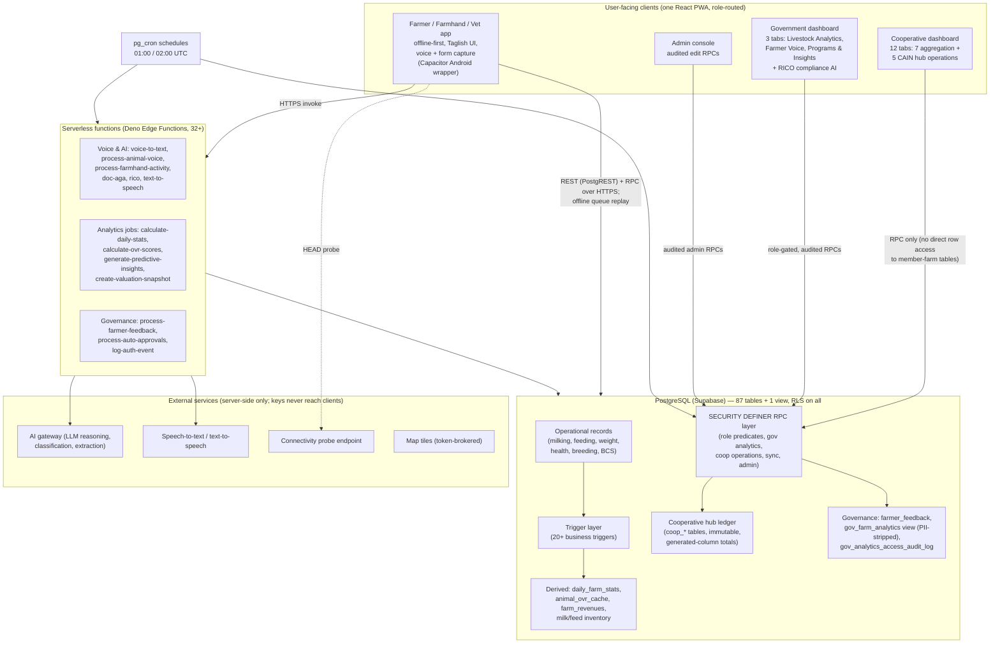

# Invention 1 — System Overview and Component Inventory

> Part of the Invention 1 Technical Disclosure Pack. See [README.md](./README.md) for scope and confidentiality notice.

This section answers the patent agent's requests for: the CAIN↔Doc Aga interaction; system components, user roles, databases, interfaces, and communication links; the operational data collected from farms and how it is generated; the contents and functions of the government oversight dashboard; and how alerts, reports, performance metrics, and farmer feedback analytics are generated.

---

## 1. The CAIN program and the Doc Aga platform — how they interact

**Doc Aga** is an offline-first livestock farm-management platform (Progressive Web App with an Android wrapper) for Filipino smallholder dairy farmers, live in the CALABARZON pilot region. Farmers record operational events (milking, feeding, weights, health, breeding, body condition) by form or voice; the platform derives finance, inventory, herd-stage, and performance analytics from those events and exposes governed, aggregate views to cooperatives and government users.

**CAIN ("Cooperative Aggregator and Integrated Nutrition")** is Golden Forage's proposed cooperative program being advocated to the Philippine Department of Agriculture (DA) and National Dairy Authority (NDA). Its core mechanism is "Milk-In, Feed-Out": farmers deliver milk to a cooperative hub; the same vehicle returns with feed as an in-kind loan; feed cost is deducted from the farmer's milk check — cashless, with zero empty miles. (Definition: `docs/superpowers/specs/2026-04-07-cain-milk-in-feed-out-cooperative-module-design.md` L11.)

**The interaction, as implemented today:** Doc Aga is the operating platform for the CAIN cooperative workflow. The cooperative module records hub milk receivings and feed disbursements against member farms, and those transactions write directly into the member farm's own Doc Aga data (milk inventory FIFO deductions, farm-side feed inventory lots, consolidated revenue entries) — so a single event stream serves the farmer's books, the cooperative's ledger, and the platform's analytics. The government oversight dashboard, in parallel, reads real-time farm operational data through audited aggregate paths. The design intent — traceability sufficient for government funds ("Government funds are involved — every transaction must be traceable", spec L35) — is embodied in the hub ledger's immutability design. The remaining CAIN↔government coupling (subsidy disbursement, compliance-gated benefits, government reads of the hub ledger) is proposed but not yet implemented; see [04-implemented-vs-proposed.md](./04-implemented-vs-proposed.md).

### System architecture

---

## 2. User roles

Roles are stored server-side in `user_roles` (global) and `farm_memberships.role_in_farm` (per-farm), read only through `SECURITY DEFINER` predicates — never from client-side claims. Enum: `farmer_owner | farmhand | merchant | vet | admin | distributor | government | cooperative` (`src/integrations/supabase/types.ts` L6277–6285).

| Role | Scope | Capabilities (as enforced by RLS/RPC) |
|---|---|---|
| Farm Owner | Own farm(s) | Full read/write on farm data; `farms.owner_id`; auto-membership trigger on farm creation |
| Manager (`farmer_owner` membership) | Member farm | Owner-equivalent operations except ownership transfer; `is_farm_manager()` |
| Farmhand | Member farm | Create operational records; writes route through `pending_activities` approval queue with auto-approve timers (`requires_approval` / `calculate_auto_approve_time`) |
| Vet | Member farm | Read animals; write health, injection, preventive-health records only (`is_vet()`) |
| Cooperative admin | Own cooperative | Hub operations (pricing, receiving, disbursement, SOA) via 19 SECURITY DEFINER RPCs; aggregate read of member farms via RPC only — no direct row access (`is_cooperative_admin()`) |
| Government officer | Cross-farm, read-only | Region/province/municipality analytics via gov RPC suite; the single write exception is `farmer_feedback` triage (status, notes, action taken); `has_government_access()` = `government` OR `admin` role |
| Admin (super-admin) | Platform | Audited edit RPCs (`admin_*`, mandatory reason, written to `admin_*_edits` tables); job triggers |
| Merchant / Distributor | Marketplace | Marketplace module (outside Invention 1 scope) |

Access enforcement for the government role is layered four deep: route guard (`src/App.tsx` L322–329), page-level redirect (`GovernmentDashboard.tsx` L426–441), login-time role check (`GovernmentAuth.tsx` L62–77), and per-RPC `RAISE EXCEPTION` gates in SQL (e.g. `get_farm_compliance_metrics`, `20260305100000_*.sql` L386–388).

---

## 3. Component inventory

### 3.1 Client application (React 18 + TypeScript + Vite; Capacitor Android wrapper, app ID `com.goldenforage.docaga`)

| Module group | Key components/locations | Function |
|---|---|---|
| Operational capture | `src/components/milk-recording/`, `feed-recording/`, `weight-recording/`, `health-recording/`, `breeding/`, `heat-detection/`, `body-condition/` | Form + voice dialogs writing the operational record tables; per-record provenance (`created_by`, `input_method`, `stt_session_id`, `client_generated_id`) |
| Voice layer | `src/components/ui/VoiceRecordWithExtraction.tsx`, `src/lib/voiceFormExtractors.ts`, `src/components/voice-training/` | STT capture, field extraction with plausibility bounds, voice-model training UI |
| Offline core | `src/lib/offlineQueue.ts`, `syncService.ts`, `dataCache.ts`, `cacheManager.ts`, `conflictDetection.ts`, `src/hooks/useOnlineStatus.ts`, `src/hooks/useOptimisticMutation.ts`, `src/sw.ts`, `src/components/sync/` | IndexedDB queue + caches, optimistic writes, active connectivity probing, background sync, conflict resolution UI |
| Farm dashboard | `src/components/farm-dashboard/`, `dashboard/`, `charts/` | Cache-first analytics (Category A reads), daily activity compliance display, checklists |
| Cooperative | `src/pages/CooperativeDashboard.tsx`, `src/components/cooperative/` (incl. `hub-operations/`, `farmer-view/`), `src/hooks/useCoop*.ts` | 7 aggregation tabs + 5 CAIN hub tabs (milk collection, hub feed, feed release, pricing, statements); farmer transparency portal |
| Government | `src/pages/GovernmentDashboard.tsx`, `src/components/government/` (30+ components), `src/hooks/useGovernment*.ts`, `useFarmComplianceMetrics.ts`, `useRegional*.ts`, `useGrant*.ts` | Online-only (Category B) oversight dashboard — detailed in §5 |
| Reporting | `src/lib/exportUtils.ts`, `src/lib/govReportCharts.ts` | CSV and multi-page PDF report generation (client-side, jsPDF + canvas charts) |
| Governance/admin | `src/components/admin/`, `approval/`, `permissions/`, `src/contexts/PermissionsContext.tsx` | Role-gated visibility (`useUnifiedPermissions()` SSOT), farmhand approval queue, audited admin edits |

### 3.2 Backend — Edge Functions (Deno/TypeScript, `supabase/functions/`)

| Group | Functions | Role in Invention 1 |
|---|---|---|
| Voice & AI capture | `voice-to-text`, `elevenlabs-scribe-token`, `text-to-speech`, `process-animal-voice`, `process-farmhand-activity`, `process-voice-training` | Convert farmer speech to validated operational records; token brokers keep vendor keys server-side |
| AI assistants | `doc-aga` (veterinary chatbot), `rico` (government compliance analyst — §5.6) | Reasoning over farm/governance data via an AI gateway |
| Analytics jobs | `calculate-daily-stats` (cron 01:00 UTC), `calculate-ovr-scores`, `generate-predictive-insights`, `create-valuation-snapshot`, `generate-morning-brief`, `backfill-stats`, `recalculate-animal`, `bulk-recalculate-carabao-stages` | Turn raw events into daily statistics, composite scores, forecasts, and valuations |
| Governance & feedback | `process-farmer-feedback` (AI triage: summary, category, sentiment, priority, farm snapshot), `extract-faq-candidates`, `submit-correction`, `process-auto-approvals`, `review-pending-activity`, `log-auth-event` | The farmer→government feedback pipeline and supervised-entry workflows |
| Operations | `admin-create-user`, `admin-permanent-delete-farm`, `seed-demo-data` (demo-gated), `send-team-invitation`, `process-email-queue`, `mapbox-token`, `merchant-signup`, `migrate-farm-locations`, `populate-weights`, `report-test-results` | Account and platform operations |

### 3.3 Database (PostgreSQL via Supabase; 87 tables + 1 view, RLS on all)

Grouped inventory (full column/FK detail and diagrams in [02-er-diagram.md](./02-er-diagram.md)):

| Domain | Tables |
|---|---|
| Farm/org/identity | `farms`, `farm_memberships`, `profiles`, `user_roles`, `user_roles_audit`, `user_invitations`, `farm_approval_settings` |
| Animals & husbandry | `animals`, `animal_events`, `animal_photos`, `barns`, `barn_assignments`, `milking_records`, `feeding_records`, `weight_records`, `body_condition_scores`, `health_records`, `health_symptom_categories`, `injection_records`, `preventive_health_protocols`, `preventive_health_schedules`, `ai_records`, `heat_records`, `heat_observation_checks`, `breeding_events` |
| Finance | `farm_revenues`, `farm_expenses`, `biological_asset_valuations`, `market_prices` |
| Inventory | `feed_inventory`, `feed_stock_transactions`, `milk_inventory` |
| Analytics/caches/jobs | `daily_farm_stats`, `monthly_farm_stats`, `animal_ovr_cache`, `stats_job_runs`, `daily_farm_checklists`, `integrity_fix_log` |
| Cooperative / CAIN hub | `cooperatives`, `cooperative_memberships`, `coop_milk_price_schedule`, `coop_milk_receivings`, `coop_feed_inventory`, `coop_feed_disbursements`, `coop_soa_periods` |
| Government/compliance | `farmer_feedback`, `gov_analytics_access_audit_log`, view `gov_farm_analytics` (PII-stripped); compliance itself is computed by RPCs, not stored |
| Feedback/AI/voice | `doc_aga_queries`, `doc_aga_faqs`, `faq_candidates`, `stt_analytics`, `transcription_corrections`, `voice_session_attempts`, `voice_training_samples` |
| Offline sync | `sync_queue`, `sync_conflicts`, `farm_sync_checkpoints`, `pending_activities` |
| Notifications/audit/admin | `notifications`, `messages`, `admin_actions`, `admin_animal_edits`, `admin_farm_edits`, `admin_profile_edits`, `user_activity_logs`, `platform_settings` |
| Marketplace & support (outside Invention 1) | `merchants`, `products`, `orders`, `order_items`, `invoices`, `distributors`, `ad_campaigns`, `ad_impressions`, `product_categories`, `support_tickets`, `ticket_comments`, `ticket_attachments`, error/email/test tables |

Client-side stores: IndexedDB databases `docAgaOfflineDB` (offline mutation queue) and `dataCacheDB` (per-domain caches with TTLs from 5 minutes to 24 hours and a 7-day offline grace period; `src/lib/dataCache.ts` L546–564).

### 3.4 Server-side function/RPC layer (all `SECURITY DEFINER`, ~293 occurrences across migrations)

| Group | Representative functions |
|---|---|
| Role/access predicates | `has_role`, `can_access_farm`, `is_farm_owner`, `is_farm_manager`, `is_farmhand`, `is_vet`, `is_super_admin`, `has_government_access`, `is_cooperative_admin`, `get_cooperative_farm_ids` |
| Government analytics | `get_government_stats`, `get_government_stats_timeseries`, `get_government_milk_analytics`, `get_government_health_stats`, `get_government_feed_consumption`, `get_government_breeding_stats`, `get_farm_compliance_metrics`, `get_regional_data_quality`, `get_regional_pcrs_summary`, `get_regional_feed_security`, `get_regional_market_prices`, `get_health_heatmap_data`, `get_grant_effectiveness`, `get_gov_farm_analytics_with_audit`, `get_farm_audit_report` |
| Cooperative hub (CAIN) | `set_coop_milk_price`, `get_active_coop_price`, `record_coop_milk_receiving`, `add_coop_feed_stock`, `record_coop_feed_disbursement`, `correct_coop_milk_receiving`, `correct_coop_feed_disbursement`, `compute_coop_soa`, `finalize_coop_soa`, `settle_coop_soa`, plus farmer-side `get_my_coop_*` reads and membership RPCs |
| Aggregation/scoring | `calculate_daily_farm_stats`, `ensure_farm_stats`, `run_daily_stats_job`, `calculate_animal_ovr`, `batch_calculate_ovr_scores`, `get_combined_dashboard_data`, `check_data_consistency` |
| Sync & supervision | `detect_sync_conflict`, `update_sync_checkpoint`, `check_stale_sync_items`, `requires_approval`, `calculate_auto_approve_time`, `approve_pending_activity` |
| Admin (audited) | `admin_edit_farm`, `admin_add_animal`, `admin_edit_animal`, `admin_edit_profile`, `admin_assign_role`, `admin_disable_user`, integrity-repair RPCs (`fix_*` → `integrity_fix_log`) |

### 3.5 Interfaces and communication links

| Link | Protocol / mechanism | Notes |
|---|---|---|
| Client ↔ database | HTTPS REST (PostgREST) + RPC calls, JWT-authenticated, RLS-enforced per row | The only data path for farm clients |
| Client ↔ Edge Functions | HTTPS invoke, JWT validated in-function | Voice, AI, feedback, exports of server work |
| Cooperative/government clients ↔ data | RPC-only lanes (no direct row reads of other tenants' tables) | Coop: aggregate RPCs behind `get_cooperative_farm_ids`; Gov: audited, PII-stripped paths |
| Scheduler ↔ jobs | `pg_cron`: 01:00 UTC HTTP POST to `calculate-daily-stats`; 02:00 UTC `run_daily_stats_job()` in-database | Job outcomes logged to `stats_job_runs` |
| Offline replay | Service Worker Background Sync (`doc-aga-sync` tag), periodic sync, and app-level triggers; idempotent inserts via `client_generated_id` unique indexes | Survives connectivity loss; 3 retries with exponential backoff |
| Connectivity sensing | Singleton HEAD probe to a generate-204 endpoint (30 s online / 10 s offline cadence, 5 s timeout, RTT-based quality classes) | `navigator.onLine` is never trusted |
| External AI/STT/TTS/maps | Server-side only via Edge Functions and short-lived token brokers (`elevenlabs-scribe-token`, `mapbox-token`) | Vendor keys never reach the client; vendor names never appear in farmer-facing UI |
| Notifications | In-app `notifications`/`messages` tables + order/feedback triggers; farmers are notified when government annotates their feedback | No government-directed push exists (proposed; see 04, P-6) |

---

## 4. Operational data collected from farms, and how it is generated

| Data | Generated by | Table(s) | Generation mechanics |
|---|---|---|---|
| Milk yield per animal per session | Farmer/farmhand — form or voice; AM/PM auto-defaulted by clock | `milking_records` → `milk_inventory` (trigger, 1:1) | Liters > 0 guard; backdate cap per farm; male-animal guard trigger; quality good/rejected |
| Feed consumption per animal | Farmer/farmhand — single or weight-proportional bulk split | `feeding_records`, `feed_inventory`, `feed_stock_transactions` | Inventory cost locked into the record (`cost_per_kg_at_time`); over-stock blocked; real-time trigger aggregation to `daily_farm_stats` |
| Body weight | Farmer/farmhand/vet | `weight_records` → `animals.current_weight_kg` (trigger) | Latest-measurement-wins trigger |
| Health events, injections, preventive schedules | Farmer/vet | `health_records`, `injection_records`, `preventive_health_schedules` | Vet role has dedicated write lane; schedules drive vaccination compliance |
| Breeding: heat, AI, pregnancy, calving | Farmer/farmhand | `heat_records`, `ai_records`, `breeding_events` | Fertility-status state machine trigger; VWP auto-transition in nightly job |
| Body condition scores | Farmer/vet | `body_condition_scores` | Feeds OVR and PCRS risk scoring |
| Milk deliveries to hub, feed received from hub | Cooperative admin (hub-side entry), verified member farms only | `coop_milk_receivings`, `coop_feed_disbursements`, `coop_soa_periods` | Generated-column totals; FIFO deduction of farm milk inventory; auto-created farm feed lot; immutable with reversal/correction pairs |
| Farmer feedback to government | Farmer — voice or text, optionally anonymous | `farmer_feedback` | Edge Function AI triage: transcription, summary, category (9 incl. `financial_assistance`, `disease_outbreak`, `feed_shortage`), sentiment, priority score, point-in-time farm snapshot |
| AI queries (veterinary chatbot) | Farmer | `doc_aga_queries` | Topic-categorized for the government "Farmer Queries" analytics |
| Provenance & supervision | System | `voice_session_attempts`, `pending_activities`, `user_activity_logs`, audit tables | Voice records link via `stt_session_id`; farmhand entries pass an approval queue |

Farm registry attributes relevant to government programs: GPS coordinates, region/province/municipality, livestock type, `is_program_participant`, `program_group` (control/pilot), `ffedis_id`, `lgu_code`, `pcic_enrolled`, `validation_status`, and `data_category` (live vs demo — every government RPC filters on it). Animals additionally carry `acquisition_type` and `grant_source` (NDA / LGU / other) for grant-effectiveness analytics.

---

## 5. The government oversight dashboard — contents and functions

Route `/government` (role-gated). Persistent chrome: cascading **National → Region → Province → Municipality** filter with 7/30/90-day and custom date presets; live/demo/all data-source selector; full-report export menu; Philippine-time banner. Filter and tab state persist in the URL. (`src/components/government/GovernmentLayout.tsx`, `GeographySelector.tsx`; `GovernmentDashboard.tsx` L165–188.)

### 5.1 Tab 1 — Livestock Analytics

| Section | Components | Key metrics (formula · thresholds) |
|---|---|---|
| Population Overview | `GovDashboardOverview`, `MapWithSummaryPanel` (choropleth regional map + milk/feed summary cards), `ComparisonSummary` | Active farms, active animals, daily logs, health events (each with growth % vs the preceding same-length window: `round((curr−prev)/prev×100)`); regional map aggregates from the **audited** `get_gov_farm_analytics_with_audit` |
| Reproduction & Breeding | `HeatDetectionMetrics`, `BreedingOverviewCards`, `BreedingSuccessChart`, `ExpectedDeliveriesTimeline` | AI success = `confirmed/performed×100` per species; deliveries due in 90 days; heat-cycle variance vs 21-day norm (≤2 normal, ≤5 slight, >5 high); animals in optimal breeding window = heat observed 18–21 days ago |
| Animal Health & Welfare | `VaccinationComplianceCard`, `BCSDistributionChart`, `MortalityAnalyticsCard`, `AnimalHealthHeatmap`, `VeterinaryExpenseHeatmap` | Vaccination compliance = `completed/scheduled×100` (≥80 green / ≥50 yellow / <50 red); mortality = `died/(active+deaths)×100` (≤2 Healthy / ≤5 Moderate / >5 High Risk); municipal disease prevalence = `events/animals×100` (≥20 Critical / ≥10 High / ≥5 Moderate); vet cost-per-animal hotspots at >1.5× regional average, Critical at ≥2× |
| Trends & Insights | `GovTrendCharts` | Time-series area charts (farms, animals, production) |

A comparison mode overlays a second geography/date window across the tab.

### 5.2 Tab 2 — Farmer Voice (feedback analytics)

Sourced from `farmer_feedback` ordered by AI `priority_score`: KPI cards (total / pending / critical / last-7-days) with top-concern category bars; a priority queue filterable by priority, status, and time window with urgent-sentiment and detected-disease badges; a geographic heat list (top 15 municipalities, color by critical/high counts); a stacked sentiment trend chart; category cluster views (clusters of ≥2); and the **Smart Insights** rule engine that converts feedback patterns into recommended government actions:

| Insight | Trigger (exact) | Suggested action |
|---|---|---|
| Disease Outbreak Alert (critical) | ≥3 `disease_outbreak` reports in 7 days | "Deploy veterinary support to {location}" |
| Feed Shortage Spike (warning) | ≥5 `feed_shortage` reports in 7 days | "Coordinate with feed suppliers for {regions}" |
| Training Demand (info) | ≥8 `training_request` in 30 days | "Schedule regional training sessions" |
| Critical Backlog (critical) | any critical-priority item still `submitted` | "Immediate review required" |
| Geographic Hotspot (info) | >5 submissions from one municipality | "Consider on-site visit or regional intervention" |

(`src/components/government/SmartInsightsPanel.tsx` L27–123.) Government users triage each item — status workflow `submitted → acknowledged → under_review → action_taken → resolved/closed`, department assignment, notes, action taken — using eight response templates including "Financial Assistance – Application Received" (`ResponseTemplates.tsx` L13–57); the farmer is notified of government notes.

### 5.3 Tab 3 — Programs & Insights

- **Grant Program Analytics**: regional investment cards (total herd investment, per-farm, per-animal, average purchase price); grant distribution (grant vs purchased vs born-on-farm mix, by grant source NDA/LGU/other); **grant effectiveness** — head-to-head comparison of grant vs purchased animals on health events, milk production, mortality (`died/total×100`), and breeding success, via RPC `get_grant_effectiveness`.
- **Production Economics**: milk production by species with revenue estimates; regional market prices; **feed security index** = `100 − critical% − low%`, where a farm is Critical below 7 estimated feed-days, Low at 7–30, Adequate at ≥30 (stock ÷ assumed 10 kg/animal/day); status Alert at ≥20% critical farms.
- **Platform Adoption**: top farmer query topics (9 bilingual keyword buckets); **Farm Operational Health** (the compliance metrics of [03-data-flow-trace.md](./03-data-flow-trace.md) §5: high ≥0.7, low <0.3, regional compliance rate; card colors ≥70 green / ≥40 yellow / <40 red); **Data Quality score** = equal-weighted 25-point components (GPS coverage, weight completeness, 30-day production tracking, 90-day health recording), with sub-50 regions flagged "may require extension support".
- **Two placeholder cards marked "Coming Soon"**: Program Participation (training attendance, vet utilization, infrastructure, subsidy program reach) and Impact Analysis (pilot vs control, government-program ROI) — the proposed subsidy-governance surface (see 04, P-1/P-4/P-5).

### 5.4 Reports and exports

Client-generated CSV and multi-page PDF reports per tab or full-dashboard, always stamped with the active filters (period, geography, data category, comparison window). The full PDF is up to 8 pages: a Republic of the Philippines / Department of Agriculture cover marked "CONFIDENTIAL — For Official Use Only", an executive dashboard with an auto-generated ≤3-sentence executive summary (flags farm-growth ±5%, the 80% vaccination target, and >10% critical feed status), then livestock trends, breeding, health (progress gauge + stacked bars), farmer voice, grants & investment, and production economics pages. Chart primitives are drawn programmatically (`src/lib/govReportCharts.ts`, 819 lines; `src/lib/exportUtils.ts`). A 9-section user manual PDF is generated on demand.

### 5.5 Privacy, audit, and data hygiene

Bulk registry reads flow through the PII-stripped `gov_farm_analytics` view (farm owner identity deliberately removed) and the audit-before-read RPC that logs user, role, access type, record count, and regions to `gov_analytics_access_audit_log` — readable only by admins. Every analytics RPC filters `data_category` so demo/seeded farms never contaminate live statistics. Farmer feedback may be submitted anonymously.

### 5.6 RICO — the government compliance AI analyst

`rico` (Edge Function) + `RicoChat` implement "RICO (Reporting & Intelligence Compliance Officer)", a read-only, `has_government_access`-gated AI analyst with 16 data tools (including `get_grant_program_analytics`, `get_vaccination_compliance`, `get_farm_compliance_metrics`). Its charter is audit defense: flag potential "ghost beneficiaries" (farms with no activity), validate geo-tagged data against expected regional patterns, and run "Audit Check" anomaly sweeps. It cannot create records and has no individual-farm drill-down (`supabase/functions/rico/index.ts` L58–99, L155–159, L240–247).

---

## 6. Known implementation inconsistencies (disclosed for accuracy)

These are minor discrepancies a diligent reviewer would find; none changes the architecture described above.

1. BCS bucket boundaries: SQL buckets at 3.0/4.0; UI labels and the manual say 2.5/4.0 (`20260305100000_*.sql` L152–154 vs `BCSDistributionChart.tsx` L34–36).
2. `has_government_access` (SQL) includes `admin`, but the client-side gate and route guard admit only `government` (`PermissionsContext.tsx` L321; `App.tsx` L325).
3. Per-RPC role gates are inconsistent: some gov RPCs check the role in-body, others rely on route/RLS layers (see `20260305100000_*.sql` vs `20260310150000_*.sql`).
4. The health heatmap card subtitle hard-codes "last 7 days" while the query window follows the active date range.
5. Feed-security counts farms with no inventory records as "adequate", understating critical percentages.
6. The average milk price shown is the first non-null daily value, not a period mean (`useGovernmentMilkAnalytics.ts` L95–97).
7. Farm-level missing-activity alert hook (`useMissingActivityAlerts`) is implemented but not currently wired into any rendered component; the same rules surface via the daily checklist and compliance card.
8. Two overview metrics (average milk, AI query count) are computed and exported to PDF but not rendered on screen.
