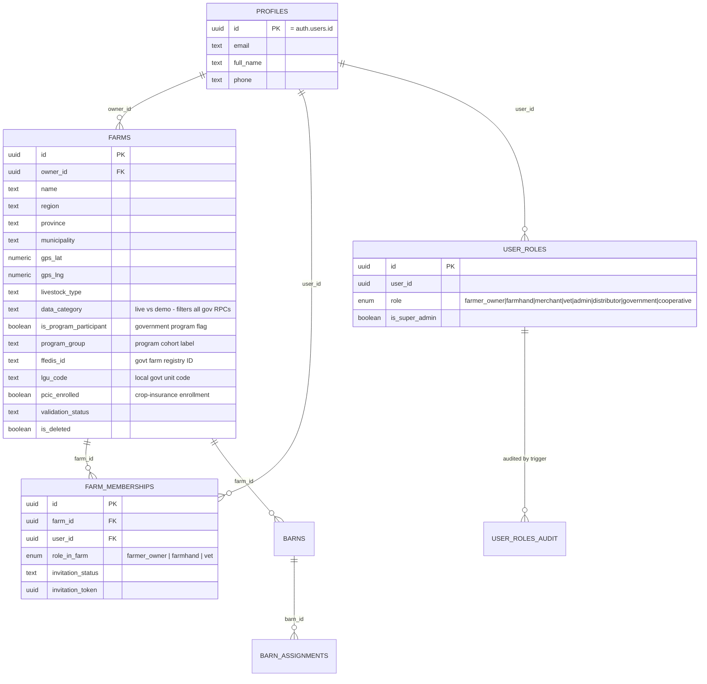
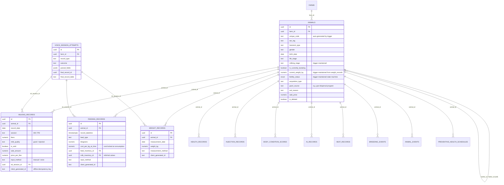
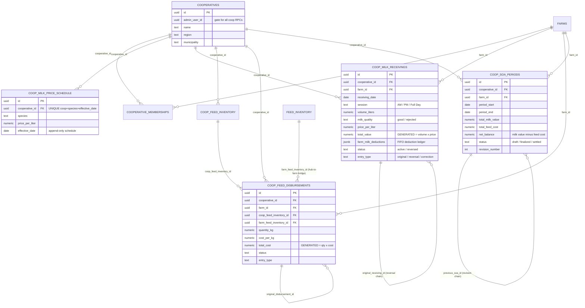
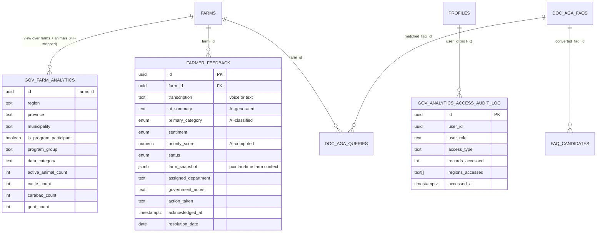
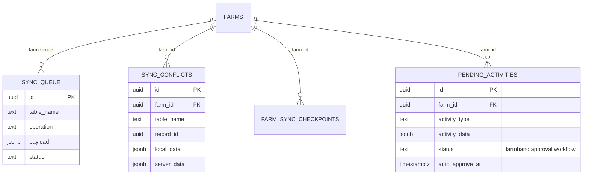

# Invention 1 — Entity-Relationship Diagrams (Derived from Database Migrations)

> Part of the Invention 1 Technical Disclosure Pack. See [README.md](./README.md) for scope and confidentiality notice.

**Sources of truth.** All entities, columns, and relationships below are extracted from the canonical schema history in `supabase/migrations/` (282 migration files) and the auto-generated schema snapshot `src/integrations/supabase/types.ts` (PostgREST-generated from the live database). Where the two disagree, `types.ts` (the live-schema snapshot) prevails. File references are given so a reader can verify every element against source.

The full public schema contains **87 tables and 1 view**. The diagrams below show the ~40 entities material to Invention 1 ("Integrated Cooperative Agricultural Program with Digital Governance Layer Linking Government Subsidy Compliance to Real-Time Livestock Management Data"), grouped by domain. Marketplace, support-ticket, email, and test-infrastructure tables are omitted as non-material.

Conventions:

- `||--o{` = one-to-many; `||--||` = one-to-one; `}o--||` = many-to-one.
- Edge labels name the foreign-key column.
- **Bold note:** every `farm_id` column also appears in the generated types with a second "relationship" to the `gov_farm_analytics` view; that is a PostgREST artifact of the view exposing `farms.id`, not a real second foreign key, and is not drawn.

---

## Diagram 1 — Farm structure, identity, and roles (the tenancy layer)

Key sources: `farms`/`profiles`/`farm_memberships` DDL in `supabase/migrations/20250930055914_*.sql`; owner auto-membership trigger `trigger_add_farm_owner_membership` (same file, ~L14); `user_role` enum values in `src/integrations/supabase/types.ts` L6277–6285. Government-program fields on `farms` (`is_program_participant`, `program_group`, `ffedis_id`, `lgu_code`, `pcic_enrolled`) are the schema-level hooks that link a farm to a government program.

---

## Diagram 2 — Animals and husbandry event records (the operational data layer)

Every farm event a farmer logs lands in one of these tables. Farm tenancy for the event tables is **indirect**: each record references `animals.id`, and row-level security dereferences `animals.farm_id`.

Key sources: `animals` (50 columns) at `types.ts` L507–700; `milking_records` L3467–3541; `feeding_records` L2715–2800; `weight_records` L4894–4949; `voice_session_attempts` L4783–4862 (voice-capture provenance: five record tables carry `stt_session_id`).

---

## Diagram 3 — Finance, inventory, and derived analytics (the trigger-maintained layer)

These tables are largely **written by database triggers and scheduled jobs, not directly by users** — this is the mechanism that turns raw farm logs into governance-grade aggregates.

```mermaid
erDiagram
    FARMS ||--o{ FARM_REVENUES : "farm_id"
    FARMS ||--o{ FARM_EXPENSES : "farm_id"
    FARMS ||--o{ FEED_INVENTORY : "farm_id"
    FARMS ||--o{ MILK_INVENTORY : "farm_id"
    FARMS ||--o{ DAILY_FARM_STATS : "farm_id"
    FARMS ||--o{ MONTHLY_FARM_STATS : "farm_id"
    FARMS ||--o{ BIOLOGICAL_ASSET_VALUATIONS : "farm_id"
    MILKING_RECORDS ||--o| FARM_REVENUES : "linked_milk_log_id (via trigger)"
    MILKING_RECORDS ||--|| MILK_INVENTORY : "milking_record_id (1:1, via trigger)"
    FEED_INVENTORY ||--o{ FEEDING_RECORDS : "feed_inventory_id"
    FEED_INVENTORY ||--o{ FEED_STOCK_TRANSACTIONS : "feed_inventory_id"
    FEED_INVENTORY ||--o{ FARM_EXPENSES : "linked_feed_inventory_id (via trigger)"
    ANIMALS ||--|| ANIMAL_OVR_CACHE : "animal_id (1:1)"
    ANIMALS ||--o{ BIOLOGICAL_ASSET_VALUATIONS : "animal_id"

    FARM_REVENUES {
        uuid id PK
        uuid farm_id FK
        numeric amount
        text source "standardized keys e.g. Milk Sales"
        date transaction_date
        uuid linked_milk_log_id FK
        uuid linked_animal_id FK
    }
    DAILY_FARM_STATS {
        uuid id PK
        uuid farm_id FK "UNIQUE (farm_id, stat_date)"
        date stat_date
        numeric total_milk_liters "job-computed"
        numeric total_feed_kg "trigger-computed"
        int feed_animal_count
        jsonb stage_counts "herd stage census"
    }
    ANIMAL_OVR_CACHE {
        uuid animal_id PK "1:1 with animals"
        numeric score "composite 0-99"
        text tier
        text trend
        jsonb breakdown "production/health/fertility/growth/BCS"
        boolean is_stale "set by 6 staleness triggers"
    }
    MILK_INVENTORY {
        uuid id PK
        uuid farm_id FK
        uuid milking_record_id FK "1:1"
        numeric liters_original
        numeric liters_remaining "FIFO-consumed"
        boolean is_available
    }
    FEED_INVENTORY {
        uuid id PK
        uuid farm_id FK
        text feed_type
        text category
        numeric quantity_kg
        numeric cost_per_unit
        numeric reorder_threshold
    }
```

Trigger provenance (all verifiable in `supabase/migrations/`):

| Derived data | Trigger | Migration |
|---|---|---|
| Milk sale → `farm_revenues` | `trigger_sync_milk_sale_to_revenue` (+ `_insert` variant) on `milking_records` | `20260122033956_*.sql` L49, L56 |
| Milking record → 1:1 `milk_inventory` row | `trg_milk_inventory_insert` / `trg_milk_inventory_update` | `20260109065448_*.sql` L60, L91 |
| Latest weight → `animals.current_weight_kg` | `trigger_sync_weight_to_animal` (+ update variant) | `20260122033956_*.sql` L107, L114 |
| Feeding records → `daily_farm_stats.total_feed_kg` | `trg_aggregate_feed_stats` (INSERT/UPDATE/DELETE) | `20260227021744_*.sql` L42 |
| Feed purchase → `farm_expenses` | `trigger_feed_purchase_expense` | `20251207093609_*.sql` L55 |
| Animal sale → revenue/valuation capture | `trg_capture_sale_price` | `20251207085302_*.sql` L223 |
| Milking record → `animals.milking_stage` | `trigger_update_milking_stage` | `20260108125520_*.sql` L19 |
| Breeding event → `animals.fertility_status` | `trigger_update_fertility_status` | `20260127144425_*.sql` L167 |
| Any production/health/fertility record change → `animal_ovr_cache.is_stale = true` | 6 triggers (`trg_milking_stale_ovr`, `trg_weight_stale_ovr`, `trg_bcs_stale_ovr`, `trg_health_schedule_stale_ovr`, `trg_ai_records_stale_ovr`, `trg_health_records_stale_ovr`) | `20260125081411_*.sql` L328–353 |
| Daily milk totals + herd stage census | `calculate_daily_farm_stats()` / `run_daily_stats_job()` (scheduled) | `20260102071505_*.sql` L7, L190 |
| OVR composite recompute | `calculate_animal_ovr()` / `batch_calculate_ovr_scores()` | `20260125081411_*.sql` L10, L248 |

---

## Diagram 4 — Cooperative / CAIN hub layer

The CAIN cooperative hub tables record physical milk-in / feed-out transactions between a cooperative hub and its member farms. Hub records are **immutable**: corrections are reversal + correction row pairs linked by self-referencing foreign keys, and monetary totals are `GENERATED ALWAYS AS ... STORED` columns that cannot be written independently of quantity × price.

Key sources: all five hub tables and 20 SECURITY DEFINER hub RPCs in `supabase/migrations/20260407120000_cain_cooperative_hub_operations.sql`; membership tables and cooperative aggregate RPCs in `20260216144612_*.sql`; revenue consolidation fix in `20260408130000_fix_coop_milk_receiving_revenue_v2.sql`.

---

## Diagram 5 — Government oversight and feedback layer

Government users never receive row-level access to farm operational tables' PII. Bulk reads flow through a PII-stripped view (`gov_farm_analytics`, owner identity deliberately removed) and audited SECURITY DEFINER RPCs; every dashboard access writes an audit row **before** data is returned.

Key sources: `gov_farm_analytics` view DDL (`security_invoker = true`, no `owner_id`) in `20260204112600_*.sql` L464–489 and PII removal in `20260122041348_*.sql` L5; audited read RPC `get_gov_farm_analytics_with_audit` in `20260109085048_*.sql` L2–53; `farmer_feedback` government SELECT/UPDATE policies in `20251122063732_*.sql` L112–121.

---

## Diagram 6 — Offline synchronization layer

Key sources: conflict detection RPC `detect_sync_conflict` and checkpoint RPC `update_sync_checkpoint` in `20260102062607_*.sql` L130, L165; farmhand approval workflow RPCs (`requires_approval`, `calculate_auto_approve_time`, `approve_pending_activity`) in `20251126134453_*.sql` L106–167. Offline idempotency is additionally enforced by `client_generated_id` columns on the husbandry record tables (Diagram 2).

---

## Row-level security model (summary)

All public tables carry row-level security. Four orthogonal access lanes exist:

1. **Farm lane (read/write).** `can_access_farm(farm_id)` — owner or accepted member (`20250930055914_*.sql` L202). Event tables without a `farm_id` dereference through `animals.farm_id`. Write privilege is graded Owner > Manager (`is_farm_manager`) > Farmhand (create-only via `pending_activities` approval) > Vet (health-record writes only, `is_vet`). All predicates are `SECURITY DEFINER` functions reading `farm_memberships` + `user_roles` server-side — roles are never trusted from the client JWT.
2. **Government lane (read-only, additive).** Gov-visible tables append `OR has_government_access(auth.uid())` to SELECT policies only; `has_government_access` = role `admin` OR `government` (`20251105133524_*.sql` L2). The single write exception: government users may UPDATE `farmer_feedback` (status, notes, action taken). Bulk reads go through the audited RPC, logging user, role, record count, and regions accessed to `gov_analytics_access_audit_log` before returning data.
3. **Cooperative lane (RPC-mediated).** Hub tables gate on `is_cooperative_admin(auth.uid(), cooperative_id)`; member farmers get SELECT-only on their own rows via `is_farm_owner`. Cooperative reach into member-farm data is granted **only** through SECURITY DEFINER aggregate RPCs that first resolve `get_cooperative_farm_ids()` (accepted memberships only) — a cooperative admin cannot SELECT `animals` or `milking_records` directly.
4. **Admin lane (audited).** All admin mutations go through `admin_*` RPCs that require a reason and write to `admin_*_edits` audit tables.
