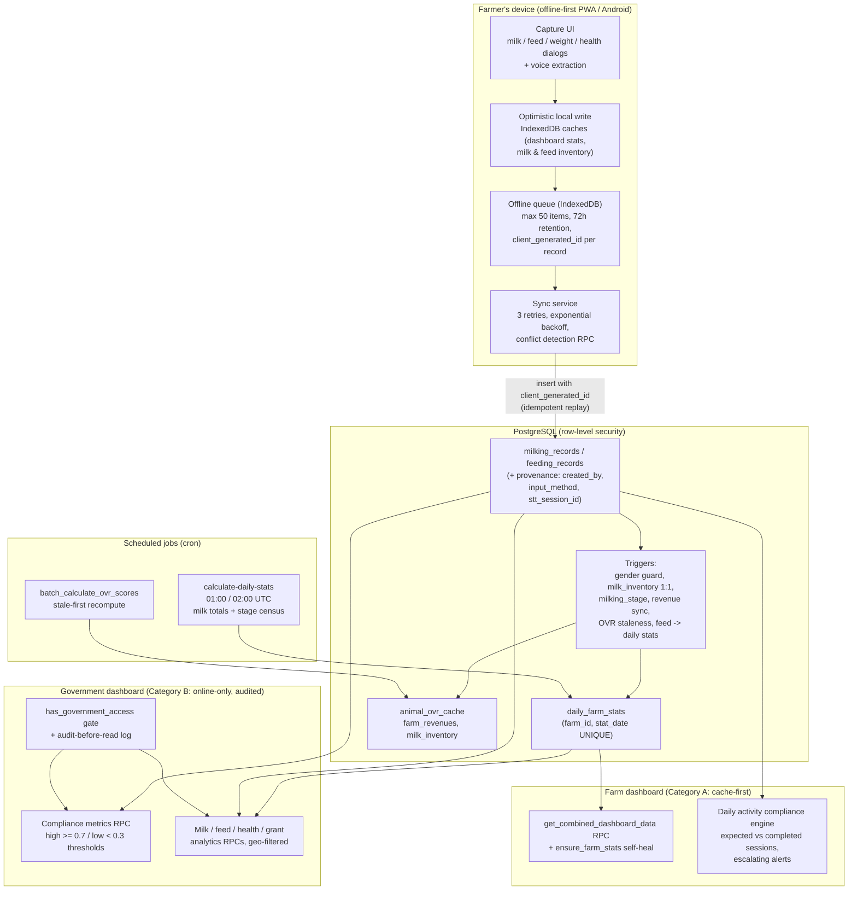

# Invention 1 — Data-Flow Trace: From Farm Log to Government Dashboard

> Part of the Invention 1 Technical Disclosure Pack. See [README.md](./README.md) for scope and confidentiality notice.

This section traces, with file-level evidence, how a single farm event recorded by a farmer becomes (a) trigger-maintained derived data, (b) aggregated daily statistics, (c) a compliance result, and (d) content on the government oversight dashboard. It ends with a worked example using realistic values, as requested by the patent agent.

All formulas and thresholds quoted below are transcribed from the implementation; citations give the file and line so each can be verified.

---

## 0. Pipeline overview

---

## 1. Stage 1 — Capture (farmer logs the event)

**Milking.** `src/components/milk-recording/RecordSingleMilkDialog.tsx` captures `liters`, `record_date`, `session` (AM/PM/Full Day, auto-defaulted by clock: `getHours() < 12 ? 'AM' : 'PM'`, L59–61), `milk_quality` (good/rejected) and a rejection reason. Guards: liters must be > 0 (L104–108); the date cannot be in the future or older than the farm's `max_backdate_days` (L277). The insert payload targets `milking_records` with provenance fields `created_by` and a client-generated idempotency key `client_generated_id` (L187–199).

**Feeding.** `src/components/feed-recording/RecordSingleFeedDialog.tsx` captures `record_date`, `feed_type` (a `feed_inventory` lot or literal "Fresh Cut and Carry"), `kilograms`. At capture time the current inventory cost is **locked into the record** as `cost_per_kg_at_time` (L129–136, L271) — the cost SSOT for all later feed-cost analytics (explicit note L310–311). Over-stock entry is blocked (L139–143, L349). Bulk feeding splits a total weight-proportionally across animals: `kilograms_i = round((weight_i / Σweight) × totalKg, 2)` (`src/lib/feedSplitCalculation.ts` L44–89).

**Voice capture.** Both dialogs embed `VoiceRecordWithExtraction` (`src/components/ui/VoiceRecordWithExtraction.tsx`); spoken input is transcribed and parsed by extractors in `src/lib/voiceFormExtractors.ts` (`extractMilkData` L272+, `extractFeedData` L710+) with plausibility thresholds: single-animal max 50 L (warning at 35), farm total max 500 L (warning at 150) (L61–66). Farmhand free-form voice activities go through the `process-farmhand-activity` Edge Function, which validates with Zod schemas, parses Filipino date keywords, enforces the farm's backdate cap, and — for farmhand roles — routes through an approval queue (`pending_activities` with `auto_approve_at`, computed by RPCs `requires_approval` / `calculate_auto_approve_time`; `supabase/functions/process-farmhand-activity/index.ts` L246–300). Voice-created records carry `stt_session_id` linking back to the `voice_session_attempts` provenance row.

## 2. Stage 2 — Offline layer (write works with zero network)

1. **Optimistic local write first.** Before any network attempt, the dialog updates IndexedDB caches so the UI reflects the event immediately: `addLocalMilkRecord` accumulates the day's milk total and recomputes the 30-day average with `syncStatus:'pending'` (`src/lib/dataCache.ts` L2057–2101); feeding updates the local daily-feed rollup and deducts local feed inventory (L2112–2197).
2. **Queue.** If offline, the event is enqueued in IndexedDB (`docAgaOfflineDB.queue`): max 50 items with oldest-eviction at capacity, 72-hour retention for completed items, statuses `pending/processing/completed/failed/awaiting_confirmation/conflict` (`src/lib/offlineQueue.ts` L10–21, L255, L322–328).
3. **Connectivity detection** never trusts `navigator.onLine`; a singleton probe HEADs `connectivitycheck.gstatic.com/generate_204` every 30 s online / 10 s offline with a 5 s timeout, classifying link quality by round-trip time (`src/hooks/useOnlineStatus.ts` L17–31).
4. **Drain.** On the offline→online transition (and via Service Worker Background Sync, a 15-minute periodic fallback, and manual retry), `syncQueue()` replays pending items with 3 retries and exponential backoff (1 s/2 s/4 s), batch-validates that parent animals still exist, and rolls back optimistic records after final failure (`src/lib/syncService.ts` L28–39, L301–472; `src/App.tsx` L105–219).
5. **Idempotent replay.** Each record's `client_generated_id` hits a unique partial index server-side; a duplicate insert returns PostgreSQL error `23505`, which the sync service treats as "already synced" and skips (`src/lib/syncService.ts` L747–752; indexes in `supabase/migrations/20260102062607_*.sql` L58–67).
6. **Conflict detection** (for update-type mutations) calls RPC `detect_sync_conflict`, which compares the server row's `updated_at` against the client timestamp (`WHERE v_server_updated_at > p_client_timestamp`) and fails closed on error; conflicts are ledgered in `sync_conflicts` for user resolution (`supabase/migrations/20260102062607_*.sql` L130–158; `src/lib/conflictDetection.ts` L31–92).

## 3. Stage 3 — Database side-effects (triggers fire on insert)

On `INSERT INTO milking_records`, four triggers fire in order:

1. `check_milking_gender` (BEFORE): rejects milking records for male animals (`20251009142731_*.sql` L2–21).
2. `trg_milk_inventory_insert` (AFTER): creates the 1:1 `milk_inventory` row with `liters_remaining = liters` and `is_available = NOT is_sold` (`20260216140526_*.sql` L23–46).
3. `trigger_update_milking_stage` (AFTER): promotes the animal to "Early Lactation" if not already in a lactation stage (`20260108125520_*.sql` L2–24).
4. `trg_milking_stale_ovr` (AFTER): marks the animal's cached performance score stale (`20260125081411_*.sql` L310–330).

When a milking record is marked sold, `sync_milk_sale_to_revenue()` books a `farm_revenues` row (`source='Milk Sales'`, `linked_milk_log_id` as the idempotency key) — `20260122033956_*.sql` L4–60.

On `INSERT INTO feeding_records`, `trg_aggregate_feed_stats` recomputes that farm-day's `SUM(kilograms)` and `COUNT(DISTINCT animal_id)` and upserts them into `daily_farm_stats` **in real time** (`20260227021744_*.sql` L2–44). Feed-inventory deduction and the `feed_stock_transactions` audit row are written by the client/sync path (not a trigger), preserving the locked `cost_per_kg_at_time`.

A `check_data_consistency(farm_id, date)` RPC can verify the invariants after the fact (milk totals vs. stats, sales vs. revenues, weights vs. animal record) — `20260122033956_*.sql` L135–215.

## 4. Stage 4 — Aggregation (jobs turn events into statistics)

**Daily farm stats.** Two redundant schedulers populate `daily_farm_stats` (UNIQUE `(farm_id, stat_date)`): the `calculate-daily-stats` Edge Function (cron 01:00 UTC; admin-gated, rate-limited) and the DB-native `run_daily_stats_job()` (cron 02:00 UTC, logged to `stats_job_runs`). Per farm-day they compute `total_milk_liters = Σ liters`, `total_feed_kg`, `feed_animal_count`, and a herd `stage_counts` JSONB census where each animal's stage key is `COALESCE(milking_stage, life_stage, 'Unknown')`. The Edge Function also recomputes every animal's life stage (age thresholds at 8/12/15 months by species) and milking stage from days since last calving (≤100 Early, ≤200 Mid, ≤305 Late, else Dry) (`supabase/functions/calculate-daily-stats/index.ts` L39–208, L279–519; SQL twin `20260227021744_*.sql` L181–207). A self-healing `ensure_farm_stats` RPC backfills up to 30 days on demand (`20260102071505_*.sql` L148–178).

**Composite animal performance (OVR).** `calculate_animal_ovr()` (`20260126044048_*.sql` L5–240) computes a 0–100 score:

- Weights — dairy: production 0.30, health 0.25, fertility 0.20, growth 0.15, body condition 0.10; non-dairy: 0.40/0.25/0.15/0.15/0.05.
- Production: `min(100, (30-day avg daily liters ÷ stage benchmark) × 83)`; benchmarks by stage: Early 12, Peak 15, Mid 10, Late 6, Dry 0, default 8 L/day. Non-lactating animals use average daily gain vs. a 500 g/day benchmark.
- Health: preventive-schedule completion % with penalties −40 (active unresolved health issue ≤30 d), −15 (milk-withdrawal condition), −15 per overdue vaccine.
- Fertility: base 50; +25 confirmed pregnancy; calving-interval bonuses (365–400 d +25; <365 +15; ≤450 +10; else −10).
- Body condition: 100 inside BCS 2.5–4.0, sloped penalties outside.
- Tier: ≥85 diamond, ≥70 gold, ≥50 silver, else bronze; trend vs. previous score ±2.

Recomputation is staleness-driven: the six `mark_ovr_cache_stale` triggers (Stage 3) flag animals, and `batch_calculate_ovr_scores` processes stale-first (`20260125081411_*.sql` L250–308).

**Predictive insights** (`supabase/functions/generate-predictive-insights/index.ts`) computes 14-day milk trend, a conservative 7-day forecast (`recentAvg × 7 × 0.95`), and a data-quality-capped confidence (`60 + min(daysWithData/30,1) × 25`, max 85%), with post-AI clamps so model output can never exceed physical capacity (L114–396). **Valuation snapshots** (`create-valuation-snapshot`) upsert per-animal `estimatedValue = effectiveWeight × marketPrice` into `biological_asset_valuations`.

## 5. Stage 5 — Compliance layer (the governance rules)

**Farm-level (live, on-device):** `src/hooks/useDailyActivityCompliance.ts` (refreshed every 60 s):

- Lactating animal := female AND (`is_currently_lactating` OR milking stage set and ≠ "Dry Period") (L109–113).
- `expectedMilkingSessions = lactatingCount × 2` (AM + PM) (L117); Full Day records count for both sessions (L130–134).
- `milkingCompliancePercent = round(completed / expected × 100)`; missing-PM only counts after 12:00 (L137–158).
- `expectedFeedingSessions = herdCount × 2`; `feedingCompliancePercent = min(100, round(completed / expected × 100))` (L162–167).
- Per-farmhand activity counts and last-activity timestamps (L170–198).

**Escalating alerts** (`src/hooks/useMissingActivityAlerts.ts`): missing AM milking becomes **urgent at 09:00**; missing PM milking **warning at 14:00, urgent at 17:00**; no feeding by **10:00** raises a warning that escalates at 14:00; a farmhand with zero activities between 08:00–17:00 raises an info alert (L26–126). A daily checklist derives required tasks from live herd state (AM/PM milking only if lactating animals exist; heat observation only if breeding-eligible animals exist) and auto-completes them from the compliance engine (`src/hooks/useDailyChecklist.ts` L57–149).

**Government-level (server-side, cross-farm):** RPC `get_farm_compliance_metrics` (`supabase/migrations/20260305100000_gov_dashboard_audit_fixes.sql` L360+), callable only by the `government` role:

- Per farm over the window: `milking_days = COUNT(DISTINCT record_date)`, `feeding_days = COUNT(DISTINCT DATE(record_datetime))`, `total_days = end − start + 1`.
- Completeness ratio: `(milking_days + feeding_days) / (total_days × 2)`.
- Classification thresholds: **≥ 0.7 → high-compliance farm; < 0.3 → low-compliance farm; ≥ 0.5 counts toward the regional `compliance_rate`** (percentage of farms at or above 0.5).
- Rolled up by region/province/municipality, always excluding demo data (`data_category` filter).

UI color thresholds on the farm side: milking compliance ≥ 80% green, ≥ 50% amber, else red (`src/components/dashboard/DailyActivityCompliance.tsx` L115–116).

## 6. Stage 6 — Dashboard consumption

**Farm dashboard (read Category A — cache-first, works offline).** `useCombinedDashboardData` renders cached stats instantly, then (if online and the 5-minute cache is stale) calls `ensure_farm_stats` followed by the single-round-trip RPC `get_combined_dashboard_data`, merging any still-pending local records by `max(server, cached)` so offline entries never disappear from the UI (`src/components/farm-dashboard/hooks/useCombinedDashboardData.ts` L83–200). The RPC computes 7-day average milk, pregnancy and health counters, and feed-stock survival days from a weight-based dry-matter model (per-animal DM need = effective weight × stage-specific intake % ÷ 0.30 forage conversion; roughage 70% / concentrate 30% split; `feedStockDays = floor(roughageStock / dailyRoughageNeed)`) (`20260227021744_*.sql` L49–145).

**Government dashboard (read Category B — online-only, no local cache).** Every hook is `@online-only` and every RPC re-checks the `government` role server-side. Feed analytics read `daily_farm_stats` (the trigger-maintained SSOT); milk analytics aggregate `milking_records` grouped by date and species with region/province/municipality and live/demo filters; compliance metrics run the Stage-5 rules. Bulk farm-registry reads go through `get_gov_farm_analytics_with_audit`, which writes user, role, record count, and regions accessed to `gov_analytics_access_audit_log` **before** returning rows from the PII-stripped view (`20260109085048_*.sql` L2–53).

---

## 7. Worked example (realistic values, end to end)

The patent agent asked for "at least one detailed example showing how actual farm data pass through the system and produce a compliance result or government action." The following example uses realistic CALABARZON pilot-scale values and only implemented mechanisms; each step names the code that executes it.

**Setup.** Farm *Sampaguita Dairy* (region CALABARZON, province Laguna, `data_category='live'`) has 10 active animals, of which 6 are lactating cows. The farm's cooperative-hub milk price for cattle is ₱52.00/L effective 2026-08-01 (`coop_milk_price_schedule`).

**Day 1 — 06:10, offline in the barn.** Farmhand Rosa records AM milking for cow C-014: 7.5 L, quality "good", by voice ("pitong litro't kalahati"). The extractor parses 7.5 L (within the 50 L single-animal bound), the dialog writes the optimistic cache (today's milk total +7.5 L, `syncStatus:'pending'`), and the event is queued offline with `client_generated_id = <uuid>_milk_0`. Rosa repeats for 5 of the 6 lactating cows — she misses cow C-019. She also logs one bulk feeding: 48 kg of Napier grass across all 10 animals, split by body weight; the lot's locked `cost_per_kg_at_time` is ₱3.20/kg.

**06:40 — signal returns.** The connectivity probe flips online; `syncQueue()` drains 6 queued items. Each `milking_records` insert fires the Stage-3 triggers: gender guard passes, a `milk_inventory` row is created per record (e.g. C-014: 7.5 L remaining, available), milking stages are confirmed, and 5 OVR cache rows go stale. The `feeding_records` inserts fire `trg_aggregate_feed_stats`, which immediately upserts `daily_farm_stats` for (Sampaguita, Day 1) with `total_feed_kg = 48`, `feed_animal_count = 10`.

**09:05 — compliance alert.** `useDailyActivityCompliance` computes: expected milking sessions = 6 × 2 = 12; completed AM = 5. Cow C-019 has no AM record and the clock has passed 09:00, so `useMissingActivityAlerts` raises an **urgent** "missed AM milking — C-019" alert on the farm dashboard (≤3 missing animals → per-animal alerts). The owner sees it and Rosa milks C-019 at 09:20 (6.8 L). AM compliance rises to 6/6.

**16:30 — PM session.** All 6 cows are milked PM (total day: 41.3 L across 12 sessions). `milkingCompliancePercent = round(12/12 × 100) = 100`. The daily checklist auto-completes `am_milking`, `pm_milking`, and `morning_feeding`.

**Day 1, 17:00 — milk to the hub (cooperative ledger).** The cooperative admin records a hub receiving for Sampaguita: 38.0 L cattle milk, session "Full Day". `record_coop_milk_receiving` verifies the accepted membership, resolves the effective price ₱52.00/L, stores `total_value` as a generated column (38.0 × 52.00 = **₱1,976.00**), FIFO-deducts the farm's `milk_inventory` (oldest lots first, recording each deduction in the `farm_milk_deductions` JSONB trail), and books one consolidated `farm_revenues` row: "Cooperative Hub delivery: 38 L @ ₱52/L".

**Night — aggregation.** At 01:00/02:00 UTC the daily-stats job upserts `daily_farm_stats` for Day 1: `total_milk_liters = 41.3`, `stage_counts = {"Early Lactation": 2, "Mid Lactation": 3, "Late Lactation": 1, "Heifer": 2, "Calf": 2}`, alongside the trigger-written feed figures. `batch_calculate_ovr_scores` recomputes the 6 stale cows; C-014, averaging 7.4 L/day over 30 days in Mid Lactation (benchmark 10 L/day), scores production `min(100, 7.4/10 × 83) = 61`; with health 90, fertility 75, growth 60, BCS 100, her dairy-weighted OVR = round(0.30×61 + 0.25×90 + 0.20×75 + 0.15×60 + 0.10×100) = **75 → gold tier**.

**Day 30 — the compliance result (government side).** A provincial livestock officer with the `government` role opens the dashboard and selects Laguna, last 30 days, live data only. `get_farm_compliance_metrics` (server-side, role-gated) computes for Sampaguita: `milking_days = 29`, `feeding_days = 27`, `total_days = 30` → ratio `(29+27)/(30×2) = 0.933` → **≥ 0.7 → counted as a high-compliance farm**. A neighboring farm with 9 milking-days and 6 feeding-days scores `15/60 = 0.25` → **< 0.3 → flagged low-compliance**. With 14 farms in the province, 11 at ratio ≥ 0.5, the regional `compliance_rate = 11/14 × 100 = 78.6%`. These figures render on the Farm Operational Health card; the officer's bulk registry read is logged to `gov_analytics_access_audit_log` (user, role, 14 records, region CALABARZON) before any data is returned. The same screen shows Laguna's 30-day milk curve (from `milking_records` aggregates), feed consumption (from `daily_farm_stats`), vaccination compliance, and grant-effectiveness comparisons for NDA-dispersed animals (`animals.grant_source`).

**Day 30 — a government action (implemented path).** Sampaguita's owner submits voice feedback through the farmer app: a request for calf-feed assistance. `process-farmer-feedback` transcribes and AI-classifies it (`primary_category = 'financial_assistance'`, sentiment, priority score) and snapshots the farm context. The officer sees it in the feedback queue, assigns it to the provincial office, replies using the "Financial Assistance – Application Received" response template, and records status and `action_taken`; the farmer is notified of the government note (`useFeedbackNotifications`). *Note: the subsequent subsidy disbursement itself is outside the implemented system — see [04-implemented-vs-proposed.md](./04-implemented-vs-proposed.md), P-1.*

**What this example demonstrates for the claims.** A single offline voice entry propagated, without any manual re-entry, through idempotent sync, five database triggers, two scheduled aggregation jobs, a farm-level compliance engine with time-graded alerts, a cooperative transaction ledger with generated-column value integrity, and an audited, PII-stripped, role-gated government analytics layer that classified the farm's compliance against fixed thresholds — the operative chain of the claimed digital governance layer.
